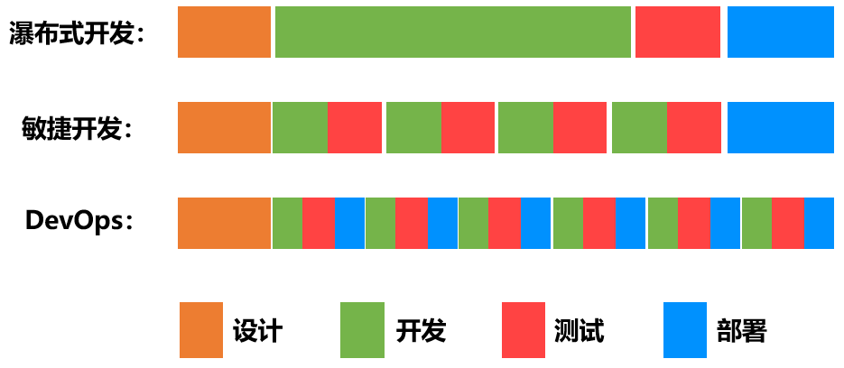
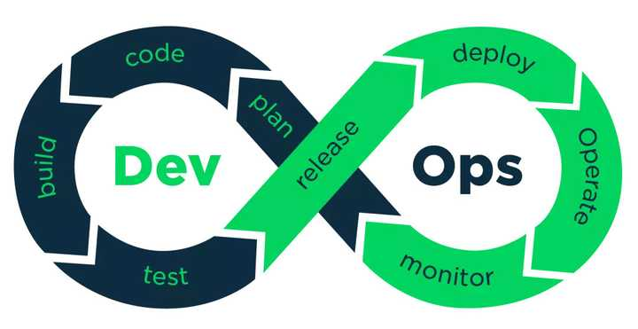
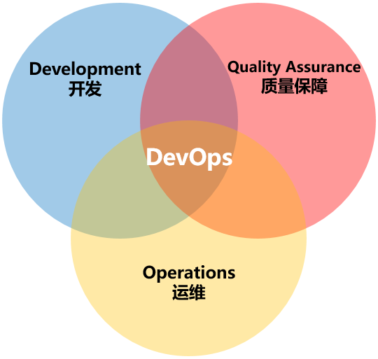

# DevOps学习笔记

## 开发流程模型

- 瀑布模型

  简而言之，就是等一个阶段所有工作完成之后，再进入下一个阶段。这种模型适合条件比较理想化（用户需求非常明确、开发时间非常充足）的项目。大家按部就班，轮流执行自己的职责即可。

- 敏捷开发

  敏捷开发以用户的需求进化为核心，采用迭代、循序渐进的方法进行软件开发。在敏捷开发中，软件项目在构建初期被切分成多个子项目，各个子项目的成果都经过测试，具备可视、可集成和可运行使用的特征。换言之，就是把一个大项目分为多个相互联系，但也可独立运行的小项目，并分别完成，在此过程中软件一直处于可使用状态。

## DevOps到底是什么

DevOps这个词，其实就是Development和Operations两个词的组合。它的英文发音是 /de'vɒps/，类似于“迪沃普斯”。

DevOps的维基百科定义是这样的：

DevOps是一组过程、方法与系统的统称，用于促进开发、技术运营和质量保障（QA）部门之间的沟通、协作与整合。

## Jenkins

### jenkins插件

- Localization: Chinese (Simplified)

  汉化插件

- Role-based Authorization Strategy

  管理Jenkins用户权限

- Credentials Binding

  管理所有凭证

- gitlab

