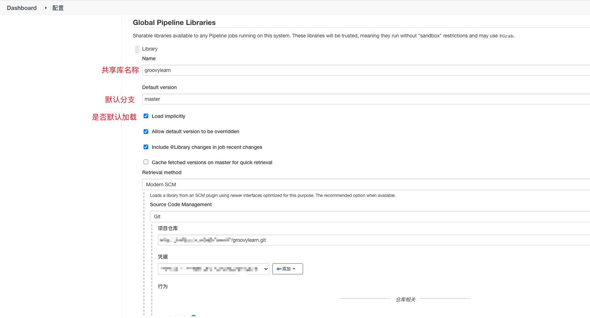

# Jenkins共享库

## 1. 介绍

如果你经常使用 Jenkins Pipeline 一定会遇到多个不同流水线中有大量重复代码的情况，很多时候为了方便我们都是直接复制粘贴到不同的管道中去的，但是长期下去这些代码的维护就会越来越麻烦。为了解决这个问题，Jenkins 中提供了共享库的概念来解决重复代码的问题，我们只需要将公共部分提取出来，然后就可以在所有的 Pipeline 中引用这些共享库下面的代码了。

共享库（shared library）是一些**独立的 Groovy 脚本的集合**，**目的就是将一些反复使用的模块进行封装**，比如拉**取代码模块，邮件通知模块**，**这样使得你的Jenkinsfile看起来更加简洁，减少代码量。**我们可以在运行 Pipeline 的时候去获取这些共享库代码。使用共享库最好的方式同样是把代码使用 Git 仓库进行托管，这样我们就可以进行版本化管理了。

## 2. 使用

使用共享库一般只需要3个步骤即可：

- 首先创建 Groovy 脚本，添加到 Git 仓库中
- 然后在 Jenkins 中配置将共享库添加到 Jenkins 中来
- 最后，在我们的流水线中导入需要使用的共享库：`@Library('your-shared-library')`，这样就可以使用共享库中的代码了。

### 2.1 目录结构

需要创建一个git仓库，并且目录结构如下

共享库的目录结构如下:

```reStructuredText
(project root)
+- src                     # Groovy source files
|   +- org
|       +- foo
|           +- Bar.groovy  # for org.foo.Bar class
+- vars
|   +- foo.groovy          # 定义一个名为 foo 的步骤
|   +- foo.txt             # 为 foo 步骤做解析，也可以说是帮助文档
+- resources               # 资源文件夹
|   +- org
|       +- foo
|           +- bar.json    # static helper data for org.foo.Bar
```

`src` 目录应该看起来像标准的 Java 源目录结构。当执行流水线时，该目录被添加到类路径下。

`vars` 目录定义可从流水线访问的全局变量的脚本。 每个 `*.groovy` 文件的基名应该是一个 Groovy (~ Java) 标识符, 通常是 `camelCased`。 匹配 `*.txt`, 如果存在, 可以包含文档, 通过系统的配置标记格式化从处理 (所以可能是 HTML, Markdown 等，虽然 `txt` 扩展是必需的)。

这些目录中的 Groovy 源文件 在脚本化流水线中的 “CPS transformation” 一样。

`resources` 目录允许从外部库中使用 `libraryResource` 步骤来加载有关的非 Groovy 文件。 目前，内部库不支持该特性。

根目录下的其他目录被保留下来以便于将来的增强。

### 2.2 共享库内容

在共享库中一般会有两种通用的代码：

- **Steps**：这些 Steps 在 Jenkins 中被称为**全局变量**，我们可以在所有的 Jenkins Pipeline 中使用这些自定义的 Steps。

比如，我们可以编写一个标准的 Step 来部署应用或者发送消息通知等，我们就可以将代码添加到 `vars/YourStepName.groovy` 文件中，然后实现一个 `call` 函数即可：

```groovy
#!/usr/bin/env groovy
// vars/YourStepName.groovy

def call() {
  // Do something here...
}
```

- **其他通用代码**：我们可以在这里面添加一些帮助类，还可以定义整个流水线中使用的静态常量等。

这些代码需要放在 `src/your/package/name` 目录下面，然后就可以使用常规的 Groovy 语法了，例如：

```groovy
#!/usr/bin/env groovy
// com/qikqiak/GlobalVars.groovy
package com.bothin

class GlobalVars {
   static String foo = "bar"
}
```

我们可以在 Jenkins Pipeline 中使用 `import` 导入上面的类，并引用其中的静态变量，比如 `GlobalVars.foo`。

### 2.3 设置全局共享库

通过*系统管理 > 系统配置 > Global Pipeline Libraries*去添加共享库，可以添加多个。



### 2.4 示例

在`vars`目录下新建一个step `vars/sayHi.groovy`

```groovy
def call(String name='bothin') {
  echo "Hello, ${name}."
}
```

创建一个名为 `src/com/bothin/GlobalVars.groovy` 的文件，文件内容如下所示：

```groovy
#!/usr/bin/env groovy
package com.bothin

class GlobalVars {
  static String foo = "bar"

  // 在 Pipeline 中可以引用这里的静态变量：
  // 
  // import com.bothin.GlobalVars
  // println GlobalVars.foo
}
```


在jenkinsfile中使用
```jenkinsfile
@Library('my-lib@master') _
import com.bothin.GlobalVars

pipeline {
    agent none
    stage ('Example') {
        steps {
             script { 
                 sayHi "jack"
                 echo GlobalVars.foo
             }
        }
    }
}
```


## 3. 步骤语法

### 3.1 内置变量

#### Jenkins

`Jenkins`是Jenkins中的一个中心类，可以通过这个类来操作jenkins的一些资源。通过`Jenkins.get()`或`Jenkins.getInstanceOrNull()`可以获取操作实例

> 类api [jenkins.model.Jenkins](https://javadoc.jenkins-ci.org/jenkins/model/Jenkins.html)


**常用实例方法**

| 方法名                                                       | 返回值                                                       | 说明                     |
| ------------------------------------------------------------ | ------------------------------------------------------------ | ------------------------ |
| **[getComputer](https://javadoc.jenkins-ci.org/jenkins/model/Jenkins.html#getComputer(java.lang.String))**(String name) | [Computer](https://javadoc.jenkins-ci.org/hudson/model/Computer.html) | 获取slave机器实例        |
| **[getNode](https://javadoc.jenkins-ci.org/jenkins/model/Jenkins.html#getNode(java.lang.String))**(String name) | [Node](https://javadoc.jenkins-ci.org/hudson/model/Node.html) | 获取给定名称的代理节点   |
| **[getPluginManager](https://javadoc.jenkins-ci.org/jenkins/model/Jenkins.html#getPluginManager())**() | [PluginManager](https://javadoc.jenkins-ci.org/hudson/PluginManager.html) | 获取插件管理器           |
| **[getPlugin](https://javadoc.jenkins-ci.org/jenkins/model/Jenkins.html#getPlugin(java.lang.String))**(String shortName) | [Plugin](https://javadoc.jenkins-ci.org/hudson/Plugin.html)  | 从其短名称获取插件对象。 |
| **[getQueue](https://javadoc.jenkins-ci.org/jenkins/model/Jenkins.html#getQueue())**() | [Queue](https://javadoc.jenkins-ci.org/hudson/model/Queue.html) | 获取构建等待队列         |


#### env

通过`env`变量可以访问到此次构建所包含的所有环境变量，同时也可以为此次构建添加环境变量

> 类api [org.jenkinsci.plugins.workflow.cps.EnvActionImpl](https://javadoc.jenkins.io/plugin/workflow-cps/org/jenkinsci/plugins/workflow/cps/EnvActionImpl.html)


**常用方法**

| 方法名                                                       | 返回值                                                       | 说明                                             |
| ------------------------------------------------------------ | ------------------------------------------------------------ | ------------------------------------------------ |
| **[getProperty](https://javadoc.jenkins.io/plugin/workflow-cps/org/jenkinsci/plugins/workflow/cps/EnvActionImpl.html#getProperty(java.lang.String))**(String propertyName) | String                                                       | 获取环境变量，也可以通过`env.xxx`获取            |
| **[setProperty](https://javadoc.jenkins.io/plugin/workflow-cps/org/jenkinsci/plugins/workflow/cps/EnvActionImpl.html#setProperty(java.lang.String,java.lang.Object))**(String propertyName, Object newValue) | void                                                         | 添加环境变量，也可以通过 `env.xxx = "xxx"`来设置 |
| **[getEnvironment](https://javadoc.jenkins.io/plugin/workflow-cps/org/jenkinsci/plugins/workflow/cps/EnvActionImpl.html#getEnvironment())**() | [EnvVars](https://javadoc.jenkins.io/hudson/EnvVars.html?is-external=true) | 获取所有环境变量                                 |

**常见内置环境变量**

| 环境变量名      | 说明                                                         |
| --------------- | ------------------------------------------------------------ |
| STAGE_NAME      | 阶段名称                                                     |
| BUILD_NUMBER    | 当前构建号                                                   |
| JOB_NAME        | 流水线全名，如果有文件夹，会包含文件夹。如：foo/bar          |
| JOB_BASE_NAME   | 流水线名称，such as "foo" for "bar/foo".                     |
| BUILD_TAG       | 构建标记 格式如 jenkins-{JOB_NAME}-{BUILD_NUMBER} 常用于保存构建中文件的文件名前缀 |
| EXECUTOR_NUMBER | 标识执行此构建的当前执行器（同一机器的执行器之间）的唯一编号 |
| JENKINS_URL     | jenkins服务地址                                              |
| NODE_NAME       | 构建机器名称                                                 |
| NODE_LABELS     | 构建机器标签                                                 |
| WORKSPACE       | 构建工作目录                                                 |


遍历所有环境变量

```groovy
def call(){
    env.getEnvironment().each { name, value ->
        println "${name}: ${value}"
    }
}
```


#### params

通过`params`可以访问此次构建定义的所有参数，这个变量只能访问不能进行修改。

> 类 java.util.Collections$UnmodifiableMap

使用示例

```groovy
if (params.BOOLEAN_PARAM_NAME) {doSomething()}

if (params.getOrDefault('BOOLEAN_PARAM_NAME', true)) {doSomething()}
```


#### currentBuild

通过这个变量可以访问当前构建的一些信息。

> 类api [org.jenkinsci.plugins.workflow.support.steps.build.RunWrapper](https://javadoc.jenkins.io/plugin/workflow-support/org/jenkinsci/plugins/workflow/support/steps/build/RunWrapper.html)

**常用方法**

| 方法名                                                       | 返回值                                                       | 说明                                                         |
| ------------------------------------------------------------ | ------------------------------------------------------------ | ------------------------------------------------------------ |
| **[getId](https://javadoc.jenkins.io/hudson/model/Run.html?is-external=true#getId())**() | String                                                       | 获取构建号                                                   |
| getResult()                                                  | String                                                       | 返回此次构建的结果                                           |
| getDisplayName()                                             | String                                                       | 获取展示的构建名称，如：\#28                                 |
| getFullDisplayName()                                         | String                                                       | 获取全部展示名称，如：cicd » cicd-pipeline-test #28          |
| getFullProjectName()                                         | String                                                       | 获取全部流水线名称，如: 9/cicd-pipeline-test                 |
| **[getRawBuild](https://javadoc.jenkins.io/plugin/workflow-support/org/jenkinsci/plugins/workflow/support/steps/build/RunWrapper.html#getRawBuild--)**() | [Run](https://javadoc.jenkins.io/hudson/model/Run.html?is-external=true)< ?,?> | 访问最核心的构建信息，pipline类型流水线的实现为[WorkflowRun](https://javadoc.jenkins.io/plugin/workflow-job/org/jenkinsci/plugins/workflow/job/WorkflowRun.html) |

[WorkflowRun](https://javadoc.jenkins.io/plugin/workflow-job/org/jenkinsci/plugins/workflow/job/WorkflowRun.html)**常用方法**

| 方法名                                                       | 返回值                                                       | 说明                                         |
| ------------------------------------------------------------ | ------------------------------------------------------------ | -------------------------------------------- |
| **[getId](https://javadoc.jenkins.io/hudson/model/Run.html?is-external=true#getId())**() | String                                                       | 获取构建号                                   |
| **[getLog](https://javadoc.jenkins.io/hudson/model/Run.html?is-external=true#getLog())**() | String                                                       | （Deprecated）获取全部构建日志               |
| **[getLog](https://javadoc.jenkins.io/hudson/model/Run.html?is-external=true#getLog(int))**(int maxLines) | List< String>                                                | 获取最多行数日志                             |
| **[getLogInputStream](https://javadoc.jenkins.io/hudson/model/Run.html?is-external=true#getLogInputStream())**() | [InputStream](https://docs.oracle.com/en/java/javase/11/docs/api/java.base/java/io/InputStream.html?is-external=true) | 获取日志文件的输入流                         |
| **[getOneOffExecutor](https://javadoc.jenkins.io/hudson/model/Run.html?is-external=true#getOneOffExecutor())**() | [Executor](https://javadoc.jenkins.io/hudson/model/Executor.html) | 如果当前在构建中，则返回构建这个作业的执行器 |
| **[getResult](https://javadoc.jenkins.io/hudson/model/Run.html?is-external=true#getResult())**() | [Result](https://javadoc.jenkins.io/hudson/model/Result.html) | 返回此次构建的结果                           |


### 3.2 常用类

#### Computer

代表远程构建的机器，获取当前执行构建的机器 `Jenkins.get().getComputer(env.NODE_NAME)`

> 类api [hudson.model.Computer](https://javadoc.jenkins-ci.org/hudson/model/Computer.html)

| 方法名                                                       | 返回值                                                       | 说明                           |
| ------------------------------------------------------------ | ------------------------------------------------------------ | ------------------------------ |
| getHostName()                                                | String                                                       | 返回机器的host                 |
| **[getMonitorData](https://javadoc.jenkins-ci.org/hudson/model/Computer.html#getMonitorData())**() | Map<String, Object>                                          | 获取机器的一些监控数据         |
| **[getAllExecutors](https://javadoc.jenkins-ci.org/hudson/model/Computer.html#getAllExecutors())**() | `List<Executor>`                                             | 获取所有执行器                 |
| **[getChannel](https://javadoc.jenkins-ci.org/hudson/model/Computer.html#getChannel())**() | abstract hudson.remoting.VirtualChannel                      | 获取用来执行构建机器程序的通道 |
| **[getTiedJobs](https://javadoc.jenkins-ci.org/hudson/model/Computer.html#getTiedJobs())**() | [List](https://docs.oracle.com/en/java/javase/11/docs/api/java.base/java/util/List.html?is-external=true) < [AbstractProject](https://javadoc.jenkins-ci.org/hudson/model/AbstractProject.html) > | 获取绑定在此节点上的项目       |
| **[isUnix](https://javadoc.jenkins-ci.org/hudson/model/Computer.html#isUnix())**() | Boolean                                                      | 判断是否是unix机器             |
| getAbsoluteRemoteFs()                                        | String                                                       | 获取远程构建机器工作根目录     |

```groovy
// 获取当前构建机器实例
def getComputer() {
    if ("master" == env.NODE_NAME) {
        def instance = Jenkins.get()
        return instance.getComputer(instance)
    }
    return Jenkins.get().getComputer(env.NODE_NAME)
}
```


#### Executor

可以通过这个类操作执行器信息。

> 类api [hudson.model.Executor](https://javadoc.jenkins.io/hudson/model/Executor.html)

**常用方法**

| 方法名                                                       | 返回值                                                       | 说明                                                |
| ------------------------------------------------------------ | ------------------------------------------------------------ | --------------------------------------------------- |
| isBusy()                                                     | boolean                                                      | 判断执行器目前是否在执行构建                        |
| **[getCurrentWorkspace](https://javadoc.jenkins.io/hudson/model/Executor.html#getCurrentWorkspace())**() | [FilePath](https://javadoc.jenkins.io/hudson/FilePath.html)  | 返回这个执行器正在使用的工作目录或null              |
| **[getCurrentWorkUnit](https://javadoc.jenkins.io/hudson/model/Executor.html#getCurrentWorkUnit())**() | [WorkUnit](https://javadoc.jenkins.io/hudson/model/queue/WorkUnit.html) | 返回目前正在执行的构建工作单元                      |
| **[getCurrentExecutable](https://javadoc.jenkins.io/hudson/model/Executor.html#getCurrentExecutable())**() | [Queue.Executable](https://javadoc.jenkins.io/hudson/model/Queue.Executable.html) | Returns the current build this executor is running. |

```groovy
// 获取正在构建的流水线名称
def getRunningPipelines(computer) {
    def runningPipeline = new HashSet()   
    for (item in computer.getExecutors()) {
        if (item.isBusy()) {
            // org.jenkinsci.plugins.workflow.support.steps.ExecutorStepExecution.PlaceholderTask
//            println item.getCurrentExecutable()
            // org.jenkinsci.plugins.workflow.job.WorkflowJob
            def job = item.getCurrentWorkUnit().work.getOwnerTask()
            runningPipeline.add(job.getFullName())
        }
    }
    return runningPipeline
}
```


#### FilePath

需要通过FilePath类才可以操作slave节点机器上的文件

> 误区：直接使用File操作的文件是Jenkins master上的机器
>
> 类api [hudson.FilePath](https://javadoc.jenkins.io/hudson/FilePath.html)

如下创建FilePath对象

```groovy
import hudson.FilePath

// 创建FilePath
def createFilePath(path) {
	if (env['NODE_NAME'] == null) {
		error "envvar NODE_NAME is not set, probably not inside an node {} or running an older version of Jenkins!"
	} else if (env['NODE_NAME'].equals("master")) {
		return new FilePath(new File(path))
	} else {
    def computer = Jenkins.get().getComputer(env['NODE_NAME'])
		return new FilePath(computer.getChannel(), path)
	}
}
```


### 3.3 引用第三方jar包

可以通过`@Grab`引用

```groovy
// 通过 : 分隔传入group、module和version
@Grab('org.apache.commons:commons-math3:3.4.1')
import org.apache.commons.math3.primes.Primes

void parallelize(int count) {
  if (!Primes.isPrime(count)) {
    error "${count} was not prime"
  }
  // …
}
```

```groovy
@Grab(group='commons-net', module='commons-net', version='2.0')
import org.apache.commons.net.ftp.FTPClient

// 上传文件到ftp
def call(String path, String target) {
    File file = new File(path)
    println("Name: " + file.name)
    println("Parent: " + file.parent)

    println("About to connect....");
    new FTPClient().with {
        connect "xxx_ftp.com"
        enterLocalPassiveMode()
        login "xx_username", "xxx_pwd"
        changeWorkingDirectory file.parent
        def incomingFile = new File(file.name)
        incomingFile.withOutputStream { ostream -> retrieveFile file.name, ostream }
        disconnect()
    }
    println("                      ...Done.");

    if(isUnix()){
        sh("mv ${file.name} ${target}")
    }else{
        bat("mv ${file.name} ${target}")
    }
}
```


### 3.4 执行groovy脚本

可以通过`RemotingDiagnostics.executeGroovy()`执行groovy脚本

**[executeGroovy](https://javadoc.jenkins.io/hudson/util/RemotingDiagnostics.html#executeGroovy(java.lang.String,hudson.remoting.VirtualChannel))**([String](https://docs.oracle.com/en/java/javase/11/docs/api/java.base/java/lang/String.html?is-external=true) script, hudson.remoting.VirtualChannel channel)

```groovy
import hudson.util.RemotingDiagnostics

/**
 * 计算目录大小
 * @param computer 执行机器
 * @param path 文件夹路径
 * @return
 */
def sizeOfDirectory(computer, String path) {
    String buildScript = "org.apache.commons.io.FileUtils.sizeOfDirectory(new File(\"${path}\"))"
    String result = RemotingDiagnostics.executeGroovy(buildScript, computer.getChannel())
    // 返回的结果会以 "Result: " 为前缀
    def size = result.replace("Result: ", "")
    return Long.valueOf(size)
}
```


## 4. 进程内的脚本批准

> https://www.jenkins.io/zh/doc/book/managing/script-approval/

```groovy
import org.jenkinsci.plugins.scriptsecurity.scripts.ScriptApproval

ScriptApproval scriptApproval = ScriptApproval.get()
def list = []
for (Object it : scriptApproval.pendingScripts) {
  list.add(it.hash)
}

for (String hash : list) {
  println(hash)
  scriptApproval.approveScript(hash);
  scriptApproval.save()
}
```


## 5. 常见问题

### 5.1 NonCPS


标有 `@NonCPS` 注解的任何方法，不经过 CPS 转换

```groovy
import com.cloudbees.groovy.cps.NonCPS


@NonCPS
def testMethod() {
}
```

> jar包地址：[groovy-cps](https://mvnrepository.com/artifact/com.cloudbees/groovy-cps/1.24)
>
> [什么是CPS编程](https://blog.csdn.net/jaytalent/article/details/105425616)


## 99. 参考

- [官方文档](https://www.jenkins.io/zh/doc/book/pipeline/shared-libraries/)

