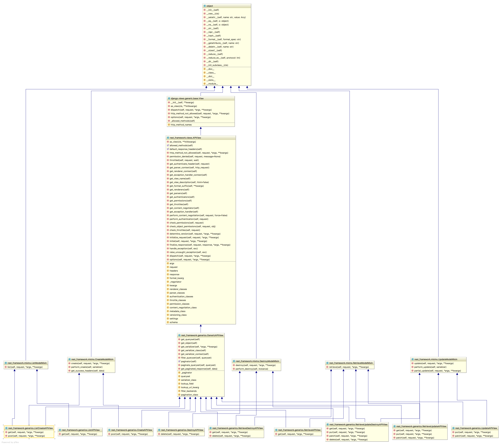
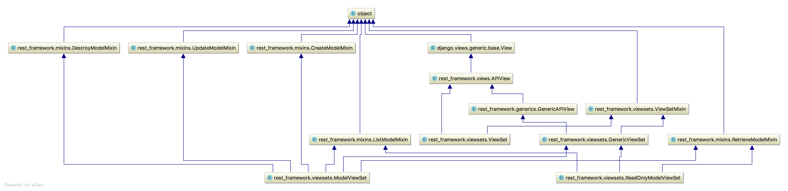

# Django REST Framework总结

## 1. 环境安装与配置

1. 安装DRF

```shell
pip install djangorestframework
```

2. 添加rest_framework应用

我们利用在Django框架学习中创建的demo工程，在**settings.py**的**INSTALLED_APPS**中添加'rest_framework'。

```python
INSTALLED_APPS = [
    ...
    'rest_framework',
]
```


## 2. Serializer序列化器

**序列化器的作用：**

1. **进行数据的校验**
2. **对数据对象进行转换**

**优秀博文：**

- [Django REST framework 序列化器](https://www.liujiangblog.com/blog/43/)

### 2.1 定义Serializer

#### 2.1.1 定义方法

Django REST framework中的Serializer使用类来定义，须继承自rest_framework.serializers.Serializer。

例如，我们已有了一个数据库模型类BookInfo

```python
class BookInfo(models.Model):
    btitle = models.CharField(max_length=20, verbose_name='名称')
    bpub_date = models.DateField(verbose_name='发布日期')
    bread = models.IntegerField(default=0, verbose_name='阅读量')
    bcomment = models.IntegerField(default=0, verbose_name='评论量')
    image = models.ImageField(upload_to='booktest', verbose_name='图片', null=True)
```

我们想为这个模型类提供一个序列化器，可以定义如下：

```python
class BookInfoSerializer(serializers.Serializer):
    """图书数据序列化器"""
    id = serializers.IntegerField(label='ID', read_only=True)
    btitle = serializers.CharField(label='名称', max_length=20)
    bpub_date = serializers.DateField(label='发布日期', required=True)
    bread = serializers.IntegerField(label='阅读量', required=False)
    bcomment = serializers.IntegerField(label='评论量', required=False)
    image = serializers.ImageField(label='图片', required=False)
```

**注意：serializer不是只能为数据库模型类定义，也可以为非数据库模型类的数据定义。**serializer是独立于数据库之外的存在。

#### 2.1.2 字段与选项

**常用字段类型**：

| 字段                    | 字段构造方式                                                 |
| ----------------------- | ------------------------------------------------------------ |
| **BooleanField**        | BooleanField()                                               |
| **NullBooleanField**    | NullBooleanField()                                           |
| **CharField**           | CharField(max_length=None, min_length=None, allow_blank=False, trim_whitespace=True) |
| **EmailField**          | EmailField(max_length=None, min_length=None, allow_blank=False) |
| **RegexField**          | RegexField(regex, max_length=None, min_length=None, allow_blank=False) |
| **SlugField**           | SlugField(max*length=50, min_length=None, allow_blank=False) 正则字段，验证正则模式 [a-zA-Z0-9*-]+ |
| **URLField**            | URLField(max_length=200, min_length=None, allow_blank=False) |
| **UUIDField**           | UUIDField(format='hex_verbose') format: 1) `'hex_verbose'` 如`"5ce0e9a5-5ffa-654b-cee0-1238041fb31a"` 2） `'hex'` 如 `"5ce0e9a55ffa654bcee01238041fb31a"` 3）`'int'` - 如: `"123456789012312313134124512351145145114"` 4）`'urn'` 如: `"urn:uuid:5ce0e9a5-5ffa-654b-cee0-1238041fb31a"` |
| **IPAddressField**      | IPAddressField(protocol='both', unpack_ipv4=False, **options) |
| **IntegerField**        | IntegerField(max_value=None, min_value=None)                 |
| **FloatField**          | FloatField(max_value=None, min_value=None)                   |
| **DecimalField**        | DecimalField(max_digits, decimal_places, coerce_to_string=None, max_value=None, min_value=None) max_digits: 最多位数 decimal_palces: 小数点位置 |
| **DateTimeField**       | DateTimeField(format=api_settings.DATETIME_FORMAT, input_formats=None) |
| **DateField**           | DateField(format=api_settings.DATE_FORMAT, input_formats=None) |
| **TimeField**           | TimeField(format=api_settings.TIME_FORMAT, input_formats=None) |
| **DurationField**       | DurationField()                                              |
| **ChoiceField**         | ChoiceField(choices) choices与Django的用法相同               |
| **MultipleChoiceField** | MultipleChoiceField(choices)                                 |
| **FileField**           | FileField(max_length=None, allow_empty_file=False, use_url=UPLOADED_FILES_USE_URL) |
| **ImageField**          | ImageField(max_length=None, allow_empty_file=False, use_url=UPLOADED_FILES_USE_URL) |
| **ListField**           | ListField(child=, min_length=None, max_length=None)          |
| **DictField**           | DictField(child=)                                            |

**选项参数：**

| 参数名称            | 作用             |
| ------------------- | ---------------- |
| **max_length**      | 最大长度         |
| **min_lenght**      | 最小长度         |
| **allow_blank**     | 是否允许为空     |
| **trim_whitespace** | 是否截断空白字符 |
| **max_value**       | 最小值           |
| **min_value**       | 最大值           |

**通用参数：**

| 参数名称           | 说明                                          |
| ------------------ | --------------------------------------------- |
| **read_only**      | 表明该字段仅用于序列化输出，默认False         |
| **write_only**     | 表明该字段仅用于反序列化输入，默认False       |
| **required**       | 表明该字段在反序列化时必须输入，默认True      |
| **default**        | 反序列化时使用的默认值                        |
| **allow_null**     | 表明该字段是否允许传入None，默认False         |
| **validators**     | 该字段使用的验证器                            |
| **error_messages** | 包含错误编号与错误信息的字典                  |
| **label**          | 用于HTML展示API页面时，显示的字段名称         |
| **help_text**      | 用于HTML展示API页面时，显示的字段帮助提示信息 |

#### 2.1.3. 创建Serializer对象

定义好Serializer类后，就可以创建Serializer对象了。

Serializer的构造方法为：

```python
Serializer(instance=None, data=empty, **kwarg)
```

说明：

1）用于序列化时，将模型类对象传入**instance**参数

2）用于反序列化时，将要被反序列化的数据传入**data**参数

3）除了instance和data参数外，在构造Serializer对象时，还可通过**context**参数额外添加数据，如

```python
serializer = AccountSerializer(account, context={'request': request})
```

**通过context参数附加的数据，可以通过Serializer对象的context属性获取。**

### 2.2 序列化使用

我们在django shell中来学习序列化器的使用。

```shell
python manage.py shell
```

#### 2.2.1 基本使用

1） 先查询出一个图书对象

```python
from booktest.models import BookInfo

book = BookInfo.objects.get(id=2)
```

2） 构造序列化器对象

```python
from booktest.serializers import BookInfoSerializer

serializer = BookInfoSerializer(book)
```

3）获取序列化数据

通过data属性可以获取序列化后的数据

```python
serializer.data
# {'id': 2, 'btitle': '天龙八部', 'bpub_date': '1986-07-24', 'bread': 36, 'bcomment': 40, 'image': None}
```

4）如果要被序列化的是包含多条数据的查询集QuerySet，可以通过添加**many=True**参数补充说明

```python
book_qs = BookInfo.objects.all()
serializer = BookInfoSerializer(book_qs, many=True)
serializer.data
# [OrderedDict([('id', 2), ('btitle', '天龙八部'), ('bpub_date', '1986-07-24'), ('bread', 36), ('bcomment', 40), ('image', N]), OrderedDict([('id', 3), ('btitle', '笑傲江湖'), ('bpub_date', '1995-12-24'), ('bread', 20), ('bcomment', 80), ('image'ne)]), OrderedDict([('id', 4), ('btitle', '雪山飞狐'), ('bpub_date', '1987-11-11'), ('bread', 58), ('bcomment', 24), ('ima None)]), OrderedDict([('id', 5), ('btitle', '西游记'), ('bpub_date', '1988-01-01'), ('bread', 10), ('bcomment', 10), ('im', 'booktest/xiyouji.png')])]
```

#### 2.2.2 关联对象嵌套序列化

如果需要序列化的数据中包含有其他关联对象，则对关联对象数据的序列化需要指明。

例如，在定义英雄数据的序列化器时，外键hbook（即所属的图书）字段如何序列化？

我们先定义HeroInfoSerialzier除外键字段外的其他部分

```python
class HeroInfoSerializer(serializers.Serializer):
    """英雄数据序列化器"""
    GENDER_CHOICES = (
        (0, 'female'),
        (1, 'male')
    )
    id = serializers.IntegerField(label='ID', read_only=True)
    hname = serializers.CharField(label='名字', max_length=20)
    hgender = serializers.ChoiceField(choices=GENDER_CHOICES, label='性别', required=False)
    hcomment = serializers.CharField(label='描述信息', max_length=200, required=False, allow_null=True)
```

对于关联字段，可以采用以下几种方式：

##### 1） PrimaryKeyRelatedField

此字段将被序列化为关联对象的主键。

```python
hbook = serializers.PrimaryKeyRelatedField(label='图书', read_only=True)
或
hbook = serializers.PrimaryKeyRelatedField(label='图书', queryset=BookInfo.objects.all())
```

指明字段时需要包含read_only=True或者queryset参数：

- 包含read_only=True参数时，该字段将不能用作反序列化使用
- 包含queryset参数时，将被用作反序列化时参数校验使用

使用效果：

```python
from booktest.serializers import HeroInfoSerializer
from booktest.models import HeroInfo
hero = HeroInfo.objects.get(id=6)
serializer = HeroInfoSerializer(hero)
serializer.data
# {'id': 6, 'hname': '乔峰', 'hgender': 1, 'hcomment': '降龙十八掌', 'hbook': 2}
```

##### 2) StringRelatedField

此字段将被序列化为关联对象的字符串表示方式（即__str__方法的返回值）

```python
hbook = serializers.StringRelatedField(label='图书')
```

使用效果

```python
{'id': 6, 'hname': '乔峰', 'hgender': 1, 'hcomment': '降龙十八掌', 'hbook': '天龙八部'}
```

##### 3）使用关联对象的序列化器

```python
hbook = BookInfoSerializer()
```

使用效果

```python
{'id': 6, 'hname': '乔峰', 'hgender': 1, 'hcomment': '降龙十八掌', 'hbook': OrderedDict([('id', 2), ('btitle', '天龙八部')te', '1986-07-24'), ('bread', 36), ('bcomment', 40), ('image', None)])}
```

#### 2.2.3 many参数

如果关联的对象数据不是只有一个，而是包含多个数据，如想序列化图书BookInfo数据，每个BookInfo对象关联的英雄HeroInfo对象可能有多个，此时关联字段类型的指明仍可使用上述几种方式，只是在声明关联字段时，多补充一个many=True参数即可。

此处仅拿PrimaryKeyRelatedField类型来举例，其他相同。

在BookInfoSerializer中添加关联字段：

```python
class BookInfoSerializer(serializers.Serializer):
    """图书数据序列化器"""
    id = serializers.IntegerField(label='ID', read_only=True)
    btitle = serializers.CharField(label='名称', max_length=20)
    bpub_date = serializers.DateField(label='发布日期', required=True)
    bread = serializers.IntegerField(label='阅读量', required=False)
    bcomment = serializers.IntegerField(label='评论量', required=False)
    image = serializers.ImageField(label='图片', required=False)
    heroinfo_set = serializers.PrimaryKeyRelatedField(read_only=True, many=True)  # 新增
```

使用效果：

```python
from booktest.serializers import BookInfoSerializer
from booktest.models import BookInfo
book = BookInfo.objects.get(id=2)
serializer = BookInfoSerializer(book)
serializer.data
# {'id': 2, 'btitle': '天龙八部', 'bpub_date': '1986-07-24', 'bread': 36, 'bcomment': 40, 'image': None, 'heroinfo_set': [6,8, 9]}
```

### 2.3 反序列化使用

#### 2.3.1. 验证

使用序列化器进行反序列化时，需要对数据进行验证后，才能获取验证成功的数据或保存成模型类对象。

在获取反序列化的数据前，必须调用**is_valid()**方法进行验证，验证成功返回True，否则返回False。

验证失败，可以通过序列化器对象的**errors**属性获取错误信息，返回字典，包含了字段和字段的错误。如果是非字段错误，可以通过修改REST framework配置中的**NON_FIELD_ERRORS_KEY**来控制错误字典中的键名。

验证成功，可以通过序列化器对象的**validated_data**属性获取数据。

在定义序列化器时，指明每个字段的序列化类型和选项参数，本身就是一种验证行为。

如我们前面定义过的BookInfoSerializer

```python
class BookInfoSerializer(serializers.Serializer):
    """图书数据序列化器"""
    id = serializers.IntegerField(label='ID', read_only=True)
    btitle = serializers.CharField(label='名称', max_length=20)
    bpub_date = serializers.DateField(label='发布日期', required=True)
    bread = serializers.IntegerField(label='阅读量', required=False)
    bcomment = serializers.IntegerField(label='评论量', required=False)
    image = serializers.ImageField(label='图片', required=False)
```

通过构造序列化器对象，并将要反序列化的数据传递给data构造参数，进而进行验证

```python
from booktest.serializers import BookInfoSerializer
data = {'bpub_date': 123}
serializer = BookInfoSerializer(data=data)
serializer.is_valid()  # 返回False
serializer.errors
# {'btitle': [ErrorDetail(string='This field is required.', code='required')], 'bpub_date': [ErrorDetail(string='Date has wrong format. Use one of these formats instead: YYYY[-MM[-DD]].', code='invalid')]}
serializer.validated_data  # {}

data = {'btitle': 'python', 'bpub_date': '1998-12-1'}
serializer = BookInfoSerializer(data=data)
serializer.is_valid()  # True
serializer.errors  # {}
serializer.validated_data  #  OrderedDict([('btitle', 'python')])
```

is_valid()方法还可以在验证失败时抛出异常serializers.ValidationError，可以通过传递**raise_exception=True**参数开启，REST framework接收到此异常，会向前端返回HTTP 400 Bad Request响应。

```python
# Return a 400 response if the data was invalid.
serializer.is_valid(raise_exception=True)
```

如果觉得这些还不够，需要再补充定义验证行为，可以使用以下三种方法：

##### 1）`validate_<field_name>`

对`<field_name>`字段进行验证，如

```python
class BookInfoSerializer(serializers.Serializer):
    """图书数据序列化器"""
    ...

    def validate_btitle(self, value):
        if 'django' not in value.lower():
            raise serializers.ValidationError("图书不是关于Django的")
        return value
```

测试

```python
from booktest.serializers import BookInfoSerializer
data = {'btitle': 'python'}
serializer = BookInfoSerializer(data=data)
serializer.is_valid()  # False   
serializer.errors
#  {'btitle': [ErrorDetail(string='图书不是关于Django的', code='invalid')]}
```

##### 2）validate

在序列化器中需要同时对多个字段进行比较验证时，可以定义validate方法来验证，如

```python
class BookInfoSerializer(serializers.Serializer):
    """图书数据序列化器"""
    ...

    def validate(self, attrs):
        bread = attrs['bread']
        bcomment = attrs['bcomment']
        if bread < bcomment:
            raise serializers.ValidationError('阅读量小于评论量')
        return attrs
```

测试

```python
from booktest.serializers import BookInfoSerializer
data = {'btitle': 'about django', 'bpub_date': '1998-12-1', 'bread': 10, 'bcomment': 20}
s = BookInfoSerializer(data=data)
s.is_valid()  # False
s.errors
#  {'non_field_errors': [ErrorDetail(string='阅读量小于评论量', code='invalid')]}
```

##### 3）validators

在字段中添加validators选项参数，也可以补充验证行为，如

```python
def about_django(value):
    if 'django' not in value.lower():
        raise serializers.ValidationError("图书不是关于Django的")

class BookInfoSerializer(serializers.Serializer):
    """图书数据序列化器"""
    id = serializers.IntegerField(label='ID', read_only=True)
    btitle = serializers.CharField(label='名称', max_length=20, validators=[about_django])
    bpub_date = serializers.DateField(label='发布日期', required=True)
    bread = serializers.IntegerField(label='阅读量', required=False)
    bcomment = serializers.IntegerField(label='评论量', required=False)
    image = serializers.ImageField(label='图片', required=False)
```

测试：

```python
from booktest.serializers import BookInfoSerializer
data = {'btitle': 'python'}
serializer = BookInfoSerializer(data=data)
serializer.is_valid()  # False   
serializer.errors
#  {'btitle': [ErrorDetail(string='图书不是关于Django的', code='invalid')]}
```

#### 2.3.2. 保存

如果在验证成功后，想要基于validated_data完成数据对象的创建，可以通过实现create()和update()两个方法来实现。

```python
class BookInfoSerializer(serializers.Serializer):
    """图书数据序列化器"""
    ...

    def create(self, validated_data):
        """新建"""
        return BookInfo(**validated_data)

    def update(self, instance, validated_data):
        """更新，instance为要更新的对象实例"""
        instance.btitle = validated_data.get('btitle', instance.btitle)
        instance.bpub_date = validated_data.get('bpub_date', instance.bpub_date)
        instance.bread = validated_data.get('bread', instance.bread)
        instance.bcomment = validated_data.get('bcomment', instance.bcomment)
        return instance
```

如果需要在返回数据对象的时候，也将数据保存到数据库中，则可以进行如下修改

```python
class BookInfoSerializer(serializers.Serializer):
    """图书数据序列化器"""
    ...

    def create(self, validated_data):
        """新建"""
        return BookInfo.objects.create(**validated_data)

    def update(self, instance, validated_data):
        """更新，instance为要更新的对象实例"""
        instance.btitle = validated_data.get('btitle', instance.btitle)
        instance.bpub_date = validated_data.get('bpub_date', instance.bpub_date)
        instance.bread = validated_data.get('bread', instance.bread)
        instance.bcomment = validated_data.get('bcomment', instance.bcomment)
        instance.save()
        return instance
```

实现了上述两个方法后，在反序列化数据的时候，就可以通过save()方法返回一个数据对象实例了

```python
book = serializer.save()
```

如果创建序列化器对象的时候，没有传递instance实例，则调用save()方法的时候，create()被调用，相反，如果传递了instance实例，则调用save()方法的时候，update()被调用。

```python
from db.serializers import BookInfoSerializer
data = {'btitle': '封神演义', 'bpub_date': '1998-1-1'}
serializer = BookInfoSerializer(data=data)
serializer.is_valid()  # True
serializer.save()  # <BookInfo: 封神演义>

from db.models import BookInfo
book = BookInfo.objects.get(id=2)
data = {'btitle': '倚天剑', 'bpub_date': '1998-12-18'}
serializer = BookInfoSerializer(book, data=data)
serializer.is_valid()  # True
serializer.save()  # <BookInfo: 倚天剑>
book.btitle  # '倚天剑'
```

**两点说明：**

1） 在对序列化器进行save()保存时，可以额外传递数据，这些数据可以在create()和update()中的validated_data参数获取到

```python
serializer.save(owner=request.user)
```

2）默认序列化器必须传递所有required为True的字段，否则会抛出验证异常。但是我们可以使用partial参数来允许部分字段在**更新**操作时可以不传,而使用原有的数据

```python
serializer = BookInfoSerializer(instance=book, data={'btitle': 'hello django', 'bpub_date': book.bpub_date})
# 两种写法最终效果等价
serializer = BookInfoSerializer(instance=book, data={'btitle': 'hello django'}, partial=True)
```

### 2.4 模型类序列化器ModelSerializer

如果我们想要使用序列化器对应的是Django的模型类，DRF为我们提供了ModelSerializer模型类序列化器来帮助我们快速创建一个Serializer类。

ModelSerializer与常规的Serializer相同，但提供了：

- 基于模型类自动生成一系列字段
- 包含默认的create()和update()的实现

#### 2.4.1. 定义

比如我们创建一个BookInfoSerializer

```python
class BookInfoSerializer(serializers.ModelSerializer):
    """图书数据序列化器"""
    class Meta:
        model = BookInfo
        fields = '__all__'
```

- model 指明参照哪个模型类
- fields 指明为模型类的哪些字段生成

我们可以在python manage.py shell中查看自动生成的BookInfoSerializer的具体实现

```python
>>> from booktest.serializers import BookInfoSerializer
>>> serializer = BookInfoSerializer()
>>> serializer
BookInfoSerializer():
    id = IntegerField(label='ID', read_only=True)
    btitle = CharField(label='名称', max_length=20)
    bpub_date = DateField(allow_null=True, label='发布日期', required=False)
    bread = IntegerField(label='阅读量', max_value=2147483647, min_value=-2147483648, required=False)
    bcomment = IntegerField(label='评论量', max_value=2147483647, min_value=-2147483648, required=False)
    image = ImageField(allow_null=True, label='图片', max_length=100, required=False)
```

#### 2.4.2. 指定字段

1) 使用**fields**来明确字段，`__all__`表名包含所有字段，也可以写明具体哪些字段，如

```python
class BookInfoSerializer(serializers.ModelSerializer):
    """图书数据序列化器"""
    class Meta:
        model = BookInfo
        fields = ('id', 'btitle', 'bpub_date')
```

2) 使用**exclude**可以明确排除掉哪些字段

```python
class BookInfoSerializer(serializers.ModelSerializer):
    """图书数据序列化器"""
    class Meta:
        model = BookInfo
        exclude = ('image',)
```

3) 显示指明字段，如：

```python
class HeroInfoSerializer(serializers.ModelSerializer):
    hbook = BookInfoSerializer()

    class Meta:
        model = HeroInfo
        fields = ('id', 'hname', 'hgender', 'hcomment', 'hbook')
```

4) 指明只读字段

可以通过**read_only_fields**指明只读字段，即仅用于序列化输出的字段

```python
class BookInfoSerializer(serializers.ModelSerializer):
    """图书数据序列化器"""
    class Meta:
        model = BookInfo
        fields = ('id', 'btitle', 'bpub_date'， 'bread', 'bcomment')
        read_only_fields = ('id', 'bread', 'bcomment')
```

#### 2.4.3. 添加额外参数

我们可以使用**extra_kwargs**参数为ModelSerializer添加或修改原有的选项参数

```python
class BookInfoSerializer(serializers.ModelSerializer):
    """图书数据序列化器"""
    class Meta:
        model = BookInfo
        fields = ('id', 'btitle', 'bpub_date', 'bread', 'bcomment')
        extra_kwargs = {
            'bread': {'min_value': 0, 'required': True},
            'bcomment': {'min_value': 0, 'required': True},
        }

# BookInfoSerializer():
#    id = IntegerField(label='ID', read_only=True)
#    btitle = CharField(label='名称', max_length=20)
#    bpub_date = DateField(allow_null=True, label='发布日期', required=False)
#    bread = IntegerField(label='阅读量', max_value=2147483647, min_value=0, required=True)
#    bcomment = IntegerField(label='评论量', max_value=2147483647, min_value=0, required=True)
```

## 3. 视图

### 3.1 Request 与 Response

#### 3.1.1. Request

REST framework 传入视图的request对象不再是Django默认的HttpRequest对象，而是REST framework提供的扩展了HttpRequest类的**Request**类的对象。

REST framework 提供了**Parser**解析器，在接收到请求后会自动根据Content-Type指明的请求数据类型（如JSON、表单等）将请求数据进行parse解析，解析为类字典对象保存到**Request**对象中。

**Request对象的数据是自动根据前端发送数据的格式进行解析之后的结果。**

无论前端发送的哪种格式的数据，我们都可以以统一的方式读取数据。

##### 常用属性

**1）.data**

`request.data` 返回解析之后的请求体数据。类似于Django中标准的`request.POST`和 `request.FILES`属性，但提供如下特性：

- 包含了解析之后的文件和非文件数据
- 包含了对POST、PUT、PATCH请求方式解析后的数据
- 利用了REST framework的parsers解析器，不仅支持表单类型数据，也支持JSON数据

**2）.query_params**

`request.query_params`与Django标准的`request.GET`相同，只是更换了更正确的名称而已。

#### 3.1.2. Response

```
rest_framework.response.Response
```

REST framework提供了一个响应类`Response`，使用该类构造响应对象时，响应的具体数据内容会被转换（render渲染）成符合前端需求的类型。

REST framework提供了`Renderer` 渲染器，用来根据请求头中的`Accept`（接收数据类型声明）来自动转换响应数据到对应格式。如果前端请求中未进行Accept声明，则会采用默认方式处理响应数据，我们可以通过配置来修改默认响应格式。

```python
REST_FRAMEWORK = {
    'DEFAULT_RENDERER_CLASSES': (  # 默认响应渲染类
        'rest_framework.renderers.JSONRenderer',  # json渲染器
        'rest_framework.renderers.BrowsableAPIRenderer',  # 浏览API渲染器
    )
}
```

**构造方式**

```python
Response(data, status=None, template_name=None, headers=None, content_type=None)
```

`data`数据不要是render处理之后的数据，只需传递python的内建类型数据即可，REST framework会使用`renderer`渲染器处理`data`。

`data`不能是复杂结构的数据，如Django的模型类对象，对于这样的数据我们可以使用`Serializer`序列化器序列化处理后（转为了Python字典类型）再传递给`data`参数。

参数说明：

- `data`: 为响应准备的序列化处理后的数据；
- `status`: 状态码，默认200；
- `template_name`: 模板名称，如果使用`HTMLRenderer` 时需指明；
- `headers`: 用于存放响应头信息的字典；
- `content_type`: 响应数据的Content-Type，通常此参数无需传递，REST framework会根据前端所需类型数据来设置该参数。

**常用属性：**

**1）.data**

传给response对象的序列化后，但尚未render处理的数据

**2）.status_code**

状态码的数字

**3）.content**

经过render处理后的响应数据

#### 3.1.3. 状态码

为了方便设置状态码，REST framewrok在`rest_framework.status`模块中提供了常用状态码常量。

##### 1）信息告知 - 1xx

```python
HTTP_100_CONTINUE
HTTP_101_SWITCHING_PROTOCOLS
```

##### 2）成功 - 2xx

```python
HTTP_200_OK
HTTP_201_CREATED
HTTP_202_ACCEPTED
HTTP_203_NON_AUTHORITATIVE_INFORMATION
HTTP_204_NO_CONTENT
HTTP_205_RESET_CONTENT
HTTP_206_PARTIAL_CONTENT
HTTP_207_MULTI_STATUS
```

##### 3）重定向 - 3xx

```python
HTTP_300_MULTIPLE_CHOICES
HTTP_301_MOVED_PERMANENTLY
HTTP_302_FOUND
HTTP_303_SEE_OTHER
HTTP_304_NOT_MODIFIED
HTTP_305_USE_PROXY
HTTP_306_RESERVED
HTTP_307_TEMPORARY_REDIRECT
```

##### 4）客户端错误 - 4xx

```python
HTTP_400_BAD_REQUEST
HTTP_401_UNAUTHORIZED
HTTP_402_PAYMENT_REQUIRED
HTTP_403_FORBIDDEN
HTTP_404_NOT_FOUND
HTTP_405_METHOD_NOT_ALLOWED
HTTP_406_NOT_ACCEPTABLE
HTTP_407_PROXY_AUTHENTICATION_REQUIRED
HTTP_408_REQUEST_TIMEOUT
HTTP_409_CONFLICT
HTTP_410_GONE
HTTP_411_LENGTH_REQUIRED
HTTP_412_PRECONDITION_FAILED
HTTP_413_REQUEST_ENTITY_TOO_LARGE
HTTP_414_REQUEST_URI_TOO_LONG
HTTP_415_UNSUPPORTED_MEDIA_TYPE
HTTP_416_REQUESTED_RANGE_NOT_SATISFIABLE
HTTP_417_EXPECTATION_FAILED
HTTP_422_UNPROCESSABLE_ENTITY
HTTP_423_LOCKED
HTTP_424_FAILED_DEPENDENCY
HTTP_428_PRECONDITION_REQUIRED
HTTP_429_TOO_MANY_REQUESTS
HTTP_431_REQUEST_HEADER_FIELDS_TOO_LARGE
HTTP_451_UNAVAILABLE_FOR_LEGAL_REASONS
```

##### 5）服务器错误 - 5xx

```python
HTTP_500_INTERNAL_SERVER_ERROR
HTTP_501_NOT_IMPLEMENTED
HTTP_502_BAD_GATEWAY
HTTP_503_SERVICE_UNAVAILABLE
HTTP_504_GATEWAY_TIMEOUT
HTTP_505_HTTP_VERSION_NOT_SUPPORTED
HTTP_507_INSUFFICIENT_STORAGE
HTTP_511_NETWORK_AUTHENTICATION_REQUIRED
```

### 3.2 视图概览

REST framework 提供了众多的通用视图基类与扩展类，以简化视图的编写。

视图的继承关系：


视图的方法与属性：



### 3.3 视图说明

#### 3.3.1. 两个基类

##### 1）APIView

```
rest_framework.views.APIView
```

`APIView`是REST framework提供的所有视图的基类，继承自Django的`View`父类。

`APIView`与`View`的不同之处在于：

- 传入到视图方法中的是REST framework的`Request`对象，而不是Django的`HttpRequeset`对象；
- 视图方法可以返回REST framework的`Response`对象，视图会为响应数据设置（render）符合前端要求的格式；
- 任何`APIException`异常都会被捕获到，并且处理成合适的响应信息；
- 在进行dispatch()分发前，会对请求进行身份认证、权限检查、流量控制。

**支持定义的属性：**

- **authentication_classes** 列表或元组，身份认证类
- **permissoin_classes** 列表或元组，权限检查类
- **throttle_classes** 列表或元组，流量控制类

在`APIView`中仍以常规的类视图定义方法来实现get() 、post() 或者其他请求方式的方法。

举例：

```python
from rest_framework.views import APIView
from rest_framework.response import Response

# url(r'^books/$', views.BookListView.as_view()),
class BookListView(APIView):
    def get(self, request):
        books = BookInfo.objects.all()
        serializer = BookInfoSerializer(books, many=True)
        return Response(serializer.data)
```

##### 2）GenericAPIView

```
rest_framework.generics.GenericAPIView
```

继承自`APIVIew`，**主要增加了操作序列化器和数据库查询的方法，作用是为下面Mixin扩展类的执行提供方法支持。通常在使用时，可搭配一个或多个Mixin扩展类。**

**提供的关于序列化器使用的属性与方法**

- 属性：

  - **serializer_class** 指明视图使用的序列化器

- 方法：

  - **get_serializer_class(self)**

    返回序列化器类，默认返回`serializer_class`，可以重写，例如：

    ```python
    def get_serializer_class(self):
        if self.request.user.is_staff:
            return FullAccountSerializer
        return BasicAccountSerializer
    ```

  - ##### get_serializer(self, *args, **kwargs)

    返回序列化器对象，主要用来提供给Mixin扩展类使用，如果我们在视图中想要获取序列化器对象，也可以直接调用此方法。

    **注意，该方法在提供序列化器对象的时候，会向序列化器对象的context属性补充三个数据：request、format、view，这三个数据对象可以在定义序列化器时使用。**

    - **request** 当前视图的请求对象
    - **view** 当前请求的类视图对象
    - format 当前请求期望返回的数据格式

**提供的关于数据库查询的属性与方法**

- 属性：

  - **queryset** 指明使用的数据查询集

- 方法：

  - **get_queryset(self)**

    返回视图使用的查询集，主要用来提供给Mixin扩展类使用，是列表视图与详情视图获取数据的基础，默认返回`queryset`属性，可以重写，例如：

    ```python
    def get_queryset(self):
        user = self.request.user
        return user.accounts.all()
    ```

  - **get_object(self)**

    返回详情视图所需的模型类数据对象，主要用来提供给Mixin扩展类使用。

    在试图中可以调用该方法获取详情信息的模型类对象。

    **若详情访问的模型类对象不存在，会返回404。**

    该方法会默认使用APIView提供的check_object_permissions方法检查当前对象是否有权限被访问。

    举例：

    ```python
    # url(r'^books/(?P<pk>\d+)/$', views.BookDetailView.as_view()),
    class BookDetailView(GenericAPIView):
        queryset = BookInfo.objects.all()
        serializer_class = BookInfoSerializer
    
        def get(self, request, pk):
            book = self.get_object() # get_object()方法根据pk参数查找queryset中的数据对象
            serializer = self.get_serializer(book)
            return Response(serializer.data)
    ```

**其他可以设置的属性**

- **pagination_class** 指明分页控制类
- **filter_backends** 指明过滤控制后端

#### 3.3.2. 五个扩展类

**作用：**

提供了几种后端视图（对数据资源进行曾删改查）处理流程的实现，如果需要编写的视图属于这五种，则视图可以通过继承相应的扩展类来复用代码，减少自己编写的代码量。

这五个扩展类需要搭配GenericAPIView父类，因为五个扩展类的实现需要调用GenericAPIView提供的序列化器与数据库查询的方法。

##### 1）ListModelMixin

列表视图扩展类，提供`list(request, *args, **kwargs)`方法快速实现列表视图，返回200状态码。

该Mixin的list方法会对数据进行过滤和分页。

源代码：

```python
class ListModelMixin(object):
    """
    List a queryset.
    """
    def list(self, request, *args, **kwargs):
        # 过滤
        queryset = self.filter_queryset(self.get_queryset())
        # 分页
        page = self.paginate_queryset(queryset)
        if page is not None:
            serializer = self.get_serializer(page, many=True)
            return self.get_paginated_response(serializer.data)
        # 序列化
        serializer = self.get_serializer(queryset, many=True)
        return Response(serializer.data)
```

举例：

```python
from rest_framework.mixins import ListModelMixin

class BookListView(ListModelMixin, GenericAPIView):
    queryset = BookInfo.objects.all()
    serializer_class = BookInfoSerializer

    def get(self, request):
        return self.list(request)
```

##### 2）CreateModelMixin

创建视图扩展类，提供`create(request, *args, **kwargs)`方法快速实现创建资源的视图，成功返回201状态码。

如果序列化器对前端发送的数据验证失败，返回400错误。

源代码：

```python
class CreateModelMixin(object):
    """
    Create a model instance.
    """
    def create(self, request, *args, **kwargs):
        # 获取序列化器
        serializer = self.get_serializer(data=request.data)
        # 验证
        serializer.is_valid(raise_exception=True)
        # 保存
        self.perform_create(serializer)
        headers = self.get_success_headers(serializer.data)
        return Response(serializer.data, status=status.HTTP_201_CREATED, headers=headers)

    def perform_create(self, serializer):
        serializer.save()

    def get_success_headers(self, data):
        try:
            return {'Location': str(data[api_settings.URL_FIELD_NAME])}
        except (TypeError, KeyError):
            return {}
```

##### 3） RetrieveModelMixin

详情视图扩展类，提供`retrieve(request, *args, **kwargs)`方法，可以快速实现返回一个存在的数据对象。

如果存在，返回200， 否则返回404。

源代码：

```python
class RetrieveModelMixin(object):
    """
    Retrieve a model instance.
    """
    def retrieve(self, request, *args, **kwargs):
        # 获取对象，会检查对象的权限
        instance = self.get_object()
        # 序列化
        serializer = self.get_serializer(instance)
        return Response(serializer.data)
```

举例：

```python
class BookDetailView(RetrieveModelMixin, GenericAPIView):
    queryset = BookInfo.objects.all()
    serializer_class = BookInfoSerializer

    def get(self, request, pk):
        return self.retrieve(request)
```

##### 4）UpdateModelMixin

更新视图扩展类，提供`update(request, *args, **kwargs)`方法，可以快速实现更新一个存在的数据对象。

同时也提供`partial_update(request, *args, **kwargs)`方法，可以实现局部更新。

成功返回200，序列化器校验数据失败时，返回400错误。

源代码：

```python
class UpdateModelMixin(object):
    """
    Update a model instance.
    """
    def update(self, request, *args, **kwargs):
        partial = kwargs.pop('partial', False)
        instance = self.get_object()
        serializer = self.get_serializer(instance, data=request.data, partial=partial)
        serializer.is_valid(raise_exception=True)
        self.perform_update(serializer)

        if getattr(instance, '_prefetched_objects_cache', None):
            # If 'prefetch_related' has been applied to a queryset, we need to
            # forcibly invalidate the prefetch cache on the instance.
            instance._prefetched_objects_cache = {}

        return Response(serializer.data)

    def perform_update(self, serializer):
        serializer.save()

    def partial_update(self, request, *args, **kwargs):
        kwargs['partial'] = True
        return self.update(request, *args, **kwargs)
```

##### 5）DestroyModelMixin

删除视图扩展类，提供`destroy(request, *args, **kwargs)`方法，可以快速实现删除一个存在的数据对象。

成功返回204，不存在返回404。

源代码：

```python
class DestroyModelMixin(object):
    """
    Destroy a model instance.
    """
    def destroy(self, request, *args, **kwargs):
        instance = self.get_object()
        self.perform_destroy(instance)
        return Response(status=status.HTTP_204_NO_CONTENT)

    def perform_destroy(self, instance):
        instance.delete()
```

#### 3.3.3. 几个可用子类视图

##### 1） CreateAPIView

提供 post 方法

继承自： GenericAPIView、CreateModelMixin

##### 2）ListAPIView

提供 get 方法

继承自：GenericAPIView、ListModelMixin

##### 3）RetrieveAPIView

提供 get 方法

继承自: GenericAPIView、RetrieveModelMixin

##### 4）DestoryAPIView

提供 delete 方法

继承自：GenericAPIView、DestoryModelMixin

##### 5）UpdateAPIView

提供 put 和 patch 方法

继承自：GenericAPIView、UpdateModelMixin

##### 6）RetrieveUpdateAPIView

提供 get、put、patch方法

继承自： GenericAPIView、RetrieveModelMixin、UpdateModelMixin

##### 7）RetrieveUpdateDestoryAPIView

提供 get、put、patch、delete方法

继承自：GenericAPIView、RetrieveModelMixin、UpdateModelMixin、DestoryModelMixin

### 3.4 视图集ViewSet

使用视图集ViewSet，可以将一系列逻辑相关的动作放到一个类中：

- list() 提供一组数据
- retrieve() 提供单个数据
- create() 创建数据
- update() 保存数据
- destory() 删除数据

ViewSet视图集类不再实现get()、post()等方法，而是实现动作 **action** 如 list() 、create() 等。

视图集只在使用as_view()方法的时候，才会将**action**动作与具体请求方式对应上。如：

```python
class BookInfoViewSet(viewsets.ViewSet):

    def list(self, request):
        books = BookInfo.objects.all()
        serializer = BookInfoSerializer(books, many=True)
        return Response(serializer.data)

    def retrieve(self, request, pk=None):
        try:
            books = BookInfo.objects.get(id=pk)
        except BookInfo.DoesNotExist:
            return Response(status=status.HTTP_404_NOT_FOUND)
        serializer = BookInfoSerializer(books)
        return Response(serializer.data)
```

在设置路由时，我们可以如下操作

```python
urlpatterns = [
    url(r'^books/$', BookInfoViewSet.as_view({'get':'list'}),
    url(r'^books/(?P<pk>\d+)/$', BookInfoViewSet.as_view({'get': 'retrieve'})
]
```

#### 3.4.1. 常用视图集父类

**1） ViewSet**

继承自`APIView`与`ViewSetMixin`，作用也与APIView基本类似，提供了身份认证、权限校验、流量管理等。

**ViewSet主要通过继承ViewSetMixin来实现在调用as_view()时传入字典（如`{'get':'list'}`）的映射处理工作。**

在ViewSet中，没有提供任何动作action方法，需要我们自己实现action方法。

**2）GenericViewSet**

使用ViewSet通常并不方便，因为list、retrieve、create、update、destory等方法都需要自己编写，而这些方法与前面讲过的Mixin扩展类提供的方法同名，所以我们可以通过继承Mixin扩展类来复用这些方法而无需自己编写。但是Mixin扩展类依赖与`GenericAPIView`，所以还需要继承`GenericAPIView`。

**GenericViewSet**就帮助我们完成了这样的继承工作，继承自`GenericAPIView`与`ViewSetMixin`，在实现了调用as_view()时传入字典（如`{'get':'list'}`）的映射处理工作的同时，还提供了`GenericAPIView`提供的基础方法，可以直接搭配Mixin扩展类使用。

举例：

```python
from rest_framework import mixins
from rest_framework.viewsets import GenericViewSet
from rest_framework.decorators import action

class BookInfoViewSet(mixins.ListModelMixin, mixins.RetrieveModelMixin, GenericViewSet):
    queryset = BookInfo.objects.all()
    serializer_class = BookInfoSerializer
```

url的定义

```python
urlpatterns = [
    url(r'^books/$', views.BookInfoViewSet.as_view({'get': 'list'})),
    url(r'^books/(?P<pk>\d+)/$', views.BookInfoViewSet.as_view({'get': 'retrieve'})),
]
```

**3）ModelViewSet**

继承自`GenericViewSet`，同时包括了ListModelMixin、RetrieveModelMixin、CreateModelMixin、UpdateModelMixin、DestoryModelMixin。

**4）ReadOnlyModelViewSet**

继承自`GenericViewSet`，同时包括了ListModelMixin、RetrieveModelMixin。

#### 3.4.2. 视图集中定义附加action动作

在视图集中，除了上述默认的方法动作外，还可以添加自定义动作。

举例：

```python
from rest_framework import mixins
from rest_framework.viewsets import GenericViewSet
from rest_framework.decorators import action

class BookInfoViewSet(mixins.ListModelMixin, mixins.RetrieveModelMixin, GenericViewSet):
    queryset = BookInfo.objects.all()
    serializer_class = BookInfoSerializer

    def latest(self, request):
        """
        返回最新的图书信息
        """
        book = BookInfo.objects.latest('id')
        serializer = self.get_serializer(book)
        return Response(serializer.data)

    def read(self, request, pk):
        """
        修改图书的阅读量数据
        """
        book = self.get_object()
        book.bread = request.data.get('bread')
        book.save()
        serializer = self.get_serializer(book)
        return Response(serializer.data)
```

url的定义

```python
urlpatterns = [
    url(r'^books/$', views.BookInfoViewSet.as_view({'get': 'list'})),
    url(r'^books/latest/$', views.BookInfoViewSet.as_view({'get': 'latest'})),
    url(r'^books/(?P<pk>\d+)/$', views.BookInfoViewSet.as_view({'get': 'retrieve'})),
    url(r'^books/(?P<pk>\d+)/read/$', views.BookInfoViewSet.as_view({'put': 'read'})),
]
```

#### 3.4.3. action属性

在视图集中，我们可以通过action对象属性来获取当前请求视图集时的action动作是哪个。

例如：

```python
def get_serializer_class(self):
    if self.action == 'create':
        return OrderCommitSerializer
    else:
        return OrderDataSerializer
```

#### 3.4.4. 视图集的继承关系




## 4. 认证Authentication

可以在配置文件中配置全局默认的认证方案

```python
REST_FRAMEWORK = {
    'DEFAULT_AUTHENTICATION_CLASSES': (
        'rest_framework.authentication.BasicAuthentication',   # 基本认证
        'rest_framework.authentication.SessionAuthentication',  # session认证
    )
}
```

也可以在每个视图中通过设置authentication_classess属性来设置

```python
from rest_framework.authentication import SessionAuthentication, BasicAuthentication
from rest_framework.views import APIView

class ExampleView(APIView):
    authentication_classes = (SessionAuthentication, BasicAuthentication)
    ...
```

认证失败会有两种可能的返回值：

- 401 Unauthorized 未认证
- 403 Permission Denied 权限被禁止

## 5. 权限Permissions

权限控制可以限制用户对于视图的访问和对于具体数据对象的访问。

- 在执行视图的dispatch()方法前，会先进行视图访问权限的判断
- 在通过get_object()获取具体对象时，会进行对象访问权限的判断

### 使用

可以在配置文件中设置默认的权限管理类，如

```python
REST_FRAMEWORK = {
    'DEFAULT_PERMISSION_CLASSES': (
        'rest_framework.permissions.IsAuthenticated',
    )
}
```

如果未指明，则采用如下默认配置

```python
'DEFAULT_PERMISSION_CLASSES': (
   'rest_framework.permissions.AllowAny',
)
```

也可以在具体的视图中通过permission_classes属性来设置，如

```python
from rest_framework.permissions import IsAuthenticated
from rest_framework.views import APIView

class ExampleView(APIView):
    permission_classes = (IsAuthenticated,)
    ...
```

### 提供的权限

- AllowAny 允许所有用户
- IsAuthenticated 仅通过认证的用户
- IsAdminUser 仅管理员用户
- IsAuthenticatedOrReadOnly 认证的用户可以完全操作，否则只能get读取

### 举例

```python
from rest_framework.authentication import SessionAuthentication
from rest_framework.permissions import IsAuthenticated
from rest_framework.generics import RetrieveAPIView

class BookDetailView(RetrieveAPIView):
    queryset = BookInfo.objects.all()
    serializer_class = BookInfoSerializer
    authentication_classes = [SessionAuthentication]
    permission_classes = [IsAuthenticated]
```

### 自定义权限

如需自定义权限，需继承rest_framework.permissions.BasePermission父类，并实现以下两个任何一个方法或全部

- `.has_permission(self, request, view)`

  是否可以访问视图， view表示当前视图对象

- `.has_object_permission(self, request, view, obj)`

  是否可以访问数据对象， view表示当前视图， obj为数据对象

例如：

```python
class MyPermission(BasePermission):
    def has_object_permission(self, request, view, obj):
        """控制对obj对象的访问权限，此案例决绝所有对对象的访问"""
        return False

class BookInfoViewSet(ModelViewSet):
    queryset = BookInfo.objects.all()
    serializer_class = BookInfoSerializer
    permission_classes = [IsAuthenticated, MyPermission]
```

## 6. 限流Throttling

可以对接口访问的频次进行限制，以减轻服务器压力。

### 使用

可以在配置文件中，使用`DEFAULT_THROTTLE_CLASSES` 和 `DEFAULT_THROTTLE_RATES`进行全局配置，

```python
REST_FRAMEWORK = {
    'DEFAULT_THROTTLE_CLASSES': (
        'rest_framework.throttling.AnonRateThrottle',
        'rest_framework.throttling.UserRateThrottle'
    ),
    'DEFAULT_THROTTLE_RATES': {
        'anon': '100/day',
        'user': '1000/day'
    }
}
```

`DEFAULT_THROTTLE_RATES` 可以使用 `second`, `minute`, `hour` 或`day`来指明周期。

也可以在具体视图中通过throttle_classess属性来配置，如

```python
from rest_framework.throttling import UserRateThrottle
from rest_framework.views import APIView

class ExampleView(APIView):
    throttle_classes = (UserRateThrottle,)
    ...
```

### 可选限流类

1） AnonRateThrottle

限制所有匿名未认证用户，使用IP区分用户。

使用`DEFAULT_THROTTLE_RATES['anon']` 来设置频次

2）UserRateThrottle

限制认证用户，使用User id 来区分。

使用`DEFAULT_THROTTLE_RATES['user']` 来设置频次

3）ScopedRateThrottle

限制用户对于每个视图的访问频次，使用ip或user id。

例如：

```
class ContactListView(APIView):
    throttle_scope = 'contacts'
    ...

class ContactDetailView(APIView):
    throttle_scope = 'contacts'
    ...

class UploadView(APIView):
    throttle_scope = 'uploads'
    ...
REST_FRAMEWORK = {
    'DEFAULT_THROTTLE_CLASSES': (
        'rest_framework.throttling.ScopedRateThrottle',
    ),
    'DEFAULT_THROTTLE_RATES': {
        'contacts': '1000/day',
        'uploads': '20/day'
    }
}
```

### 实例

```python
from rest_framework.authentication import SessionAuthentication
from rest_framework.permissions import IsAuthenticated
from rest_framework.generics import RetrieveAPIView
from rest_framework.throttling import UserRateThrottle

class BookDetailView(RetrieveAPIView):
    queryset = BookInfo.objects.all()
    serializer_class = BookInfoSerializer
    authentication_classes = [SessionAuthentication]
    permission_classes = [IsAuthenticated]
    throttle_classes = (UserRateThrottle,)
```

## 7. 过滤Filtering

对于列表数据可能需要根据字段进行过滤，我们可以通过添加django-fitlter扩展来增强支持。

```shel
pip install django-filter
```

在配置文件中增加过滤后端的设置：

```python
INSTALLED_APPS = [
    ...
    'django_filters',  # 需要注册应用，
]

REST_FRAMEWORK = {
    'DEFAULT_FILTER_BACKENDS': ('django_filters.rest_framework.DjangoFilterBackend',)
}
```

在视图中添加filter_fields属性，指定可以过滤的字段

```python
class BookListView(ListAPIView):
    queryset = BookInfo.objects.all()
    serializer_class = BookInfoSerializer
    filter_fields = ('btitle', 'bread')

# 127.0.0.1:8000/books/?btitle=西游记
```

## 8. 排序

对于列表数据，REST framework提供了**OrderingFilter**过滤器来帮助我们快速指明数据按照指定字段进行排序。

**使用方法：**

在类视图中设置filter_backends，使用`rest_framework.filters.OrderingFilter`过滤器，REST framework会在请求的查询字符串参数中检查是否包含了ordering参数，如果包含了ordering参数，则按照ordering参数指明的排序字段对数据集进行排序。

前端可以传递的ordering参数的可选字段值需要在ordering_fields中指明。

示例：

```python
class BookListView(ListAPIView):
    queryset = BookInfo.objects.all()
    serializer_class = BookInfoSerializer
    filter_backends = [OrderingFilter]
    ordering_fields = ('id', 'bread', 'bpub_date')

# 127.0.0.1:8000/books/?ordering=-bread
```

## 9. 分页Pagination

REST framework提供了分页的支持。

我们可以在配置文件中设置全局的分页方式，如：

```python
REST_FRAMEWORK = {
    'DEFAULT_PAGINATION_CLASS':  'rest_framework.pagination.PageNumberPagination',
    'PAGE_SIZE': 100  # 每页数目
}
```

也可通过自定义Pagination类，来为视图添加不同分页行为。在视图中通过`pagination_clas`属性来指明。

```python
class LargeResultsSetPagination(PageNumberPagination):
    page_size = 1000
    page_size_query_param = 'page_size'
    max_page_size = 10000
class BookDetailView(RetrieveAPIView):
    queryset = BookInfo.objects.all()
    serializer_class = BookInfoSerializer
    pagination_class = LargeResultsSetPagination
```

**注意：如果在视图内关闭分页功能，只需在视图内设置**

```python
pagination_class = None
```

**可选分页器**

1） **PageNumberPagination**

前端访问网址形式：

```http
GET  http://api.example.org/books/?page=4
```

可以在子类中定义的属性：

- page_size 每页数目
- page_query_param 前端发送的页数关键字名，默认为"page"
- page_size_query_param 前端发送的每页数目关键字名，默认为None
- max_page_size 前端最多能设置的每页数量

```python
from rest_framework.pagination import PageNumberPagination

class StandardPageNumberPagination(PageNumberPagination):
    page_size_query_param = 'page_size'
    max_page_size = 10

class BookListView(ListAPIView):
    queryset = BookInfo.objects.all().order_by('id')
    serializer_class = BookInfoSerializer
    pagination_class = StandardPageNumberPagination

# 127.0.0.1/books/?page=1&page_size=2
```

2）**LimitOffsetPagination**

前端访问网址形式：

```http
GET http://api.example.org/books/?limit=100&offset=400
```

可以在子类中定义的属性：

- default_limit 默认限制，默认值与`PAGE_SIZE`设置一直
- limit_query_param limit参数名，默认'limit'
- offset_query_param offset参数名，默认'offset'
- max_limit 最大limit限制，默认None

```python
from rest_framework.pagination import LimitOffsetPagination

class BookListView(ListAPIView):
    queryset = BookInfo.objects.all().order_by('id')
    serializer_class = BookInfoSerializer
    pagination_class = LimitOffsetPagination

# 127.0.0.1:8000/books/?offset=3&limit=2
```

## 10. 异常处理 Exceptions

REST framework提供了异常处理，我们可以自定义异常处理函数。

```python
from rest_framework.views import exception_handler

def custom_exception_handler(exc, context):
    # 先调用REST framework默认的异常处理方法获得标准错误响应对象
    response = exception_handler(exc, context)

    # 在此处补充自定义的异常处理
    if response is not None:
        response.data['status_code'] = response.status_code

    return response
```

在配置文件中声明自定义的异常处理

```python
REST_FRAMEWORK = {
    'EXCEPTION_HANDLER': 'my_project.my_app.utils.custom_exception_handler'
}
```

如果未声明，会采用默认的方式，如下

```python
REST_FRAMEWORK = {
    'EXCEPTION_HANDLER': 'rest_framework.views.exception_handler'
}
```

例如：

补充上处理关于数据库的异常

```python
from rest_framework.views import exception_handler as drf_exception_handler
from rest_framework import status
from django.db import DatabaseError

def exception_handler(exc, context):
    response = drf_exception_handler(exc, context)

    if response is None:
        view = context['view']
        if isinstance(exc, DatabaseError):
            print('[%s]: %s' % (view, exc))
            response = Response({'detail': '服务器内部错误'}, status=status.HTTP_507_INSUFFICIENT_STORAGE)

    return response
```

**REST framework定义的异常**

- APIException 所有异常的父类
- ParseError 解析错误
- AuthenticationFailed 认证失败
- NotAuthenticated 尚未认证
- PermissionDenied 权限决绝
- NotFound 未找到
- MethodNotAllowed 请求方式不支持
- NotAcceptable 要获取的数据格式不支持
- Throttled 超过限流次数
- ValidationError 校验失败