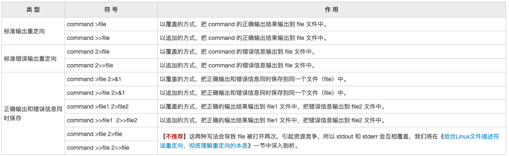

# Linux学习笔记

## Linux常用命令

### cp 命令

**语法**

```shell
cp [options] source dest
```

**参数说明**：

- -a：此选项通常在复制目录时使用，它保留链接、文件属性，并复制目录下的所有内容。其作用等于dpR参数组合。
- -d：复制时保留链接。这里所说的链接相当于 Windows 系统中的快捷方式。
- -f：覆盖已经存在的目标文件而不给出提示。
- -i：与 **-f** 选项相反，在覆盖目标文件之前给出提示，要求用户确认是否覆盖，回答 **y** 时目标文件将被覆盖。
- -p：除复制文件的内容外，还把修改时间和访问权限也复制到新文件中。
- -r：若给出的源文件是一个目录文件，此时将复制该目录下所有的子目录和文件。
- -l：不复制文件，只是生成链接文件。

注意：用户使用该指令复制目录时，必须使用参数 **-r** 或者 **-R** 

### grep

### egrep

### sed

### awk


### 参考

- [Linux常用命令详解](https://www.jianshu.com/p/0fe7c60b0ec7)
- [Linux命令列表【简洁】](https://www.jianshu.com/p/4c2e6b5acd20)
- [菜鸟教程 常见Linux命令](https://www.runoob.com/w3cnote/linux-common-command-2.html)
- [菜鸟教程 Linux 命令大全](https://www.runoob.com/linux/linux-command-manual.html)
- [Linux中的pushd和popd](https://www.jianshu.com/p/53cccae3c443)


## Linux常识

### linux 输入输出重定向

#### 什么是输入输出方向呢？

一般情况下，我们都是从键盘读取用户输入的数据，然后再把数据拿到程序（C语言程序、Shell 脚本程序等）中使用；这就是标准的输入方向，也就是从键盘到程序。反过来说，程序中也会产生数据，这些数据一般都是直接呈现到显示器上，这就是标准的输出方向，也就是从程序到显示器。

其实输入输出方向就是数据的流动方向：

- 输入方向就是数据从哪里流向程序。数据默认从键盘流向程序，如果改变了它的方向，数据就从其它地方流入，这就是输入重定向。
- 输出方向就是数据从程序流向哪里。数据默认从程序流向显示器，如果改变了它的方向，数据就流向其它地方，这就是输出重定向。

#### 文件描述符

Linux 中一切皆文件，包括标准输入设备（键盘）和标准输出设备（显示器）在内的所有计算机硬件都是文件。

为了表示和区分已经打开的文件，Linux 会给每个文件分配一个 ID，这个 ID 就是一个整数，被称为文件描述符（File Descriptor）。

| 文件描述符 | 文件名 | 类型             | 硬件   |
| ---------- | ------ | ---------------- | ------ |
| 0          | stdin  | 标准输入文件     | 键盘   |
| 1          | stdout | 标准输出文件     | 显示器 |
| 2          | stderr | 标准错误输出文件 | 显示器 |


Linux 程序在执行任何形式的 I/O 操作时，都是在读取或者写入一个文件描述符。一个文件描述符只是一个和打开的文件相关联的整数，它的背后可能是一个硬盘上的普通文件、FIFO、管道、终端、键盘、显示器，甚至是一个网络连接。

stdin、stdout、stderr 默认都是打开的，在重定向的过程中，0、1、2 这三个文件描述符可以直接使用。

#### Shell 输出重定向

输出重定向是指命令的结果不再输出到显示器上，而是输出到其它地方，一般是文件中。这样做的最大好处就是把命令的结果保存起来，当我们需要的时候可以随时查询。Bash 支持的输出重定向符号如下表所示。



在输出重定向中，`>`代表的是覆盖，`>>`代表的是追加。

`command > file 2>&1` 其中`&1`为转义为标准输出文件描述符
首先是command > file将标准输出重定向到file中， 2>&1 是标准错误拷贝了标准输出的行为，也就是同样被重定向到file中，最终结果就是标准输出和错误都被重定向到file中。

**注意**

输出重定向的完整写法其实是`fd>file`或者`fd>>file`，其中 fd 表示文件描述符，如果不写，默认为 1，也就是标准输出文件。

**当文件描述符为 1 时，一般都省略不写**，如上表所示；当然，如果你愿意，也可以将`command >file`写作`command 1>file`，但这样做是多此一举。

当文件描述符为大于 1 的值时，比如 2，就必须写上。

**需要重点说明的是**，`fd`和`>`之间不能有空格，否则 Shell 会解析失败；`>`和`file`之间的空格可有可无。为了保持一致，我习惯在`>`两边都不加空格。

下面的语句是一个反面教材：

echo "c.biancheng.net" 1 >log.txt

注意`1`和`>`之间的空格。echo 命令的输出结果是`c.biancheng.net`，我们的初衷是将输出结果重定向到 log.txt，但是当你打开 log.txt 文件后，发现文件的内容为`c.biancheng.net 1`，这就是多余的空格导致的解析错误。也就是说，Shell 将该条语句理解成了下面的形式：

echo "c.biancheng.net" 1 1>log.txt

#### 

【实例】将 echo 命令的输出结果以追加的方式写入到 demo.txt 文件中。

```
#!/bin/bashfor str in "C语言中文网" "http://c.biancheng.net/" "成立7年了" "日IP数万"do    echo $str >>demo.txt  #将输入结果以追加的方式重定向到文件done
```

运行以上脚本，使用`cat demo.txt`查看文件内容，显示如下：

```text
C语言中文网
http://c.biancheng.net/
成立7年了
日IP数万
```

#### Shell 输入重定向

输入重定向就是改变输入的方向，不再使用键盘作为命令输入的来源，而是使用文件作为命令的输入。

| 符号                  | 说明                                                         |
| --------------------- | ------------------------------------------------------------ |
| command <file         | 将 file 文件中的内容作为 command 的输入。                    |
| command <<END         | 从标准输入（键盘）中读取数据，直到遇见分界符 END 才停止（分界符可以是任意的字符串，用户自己定义）。 |
| command <file1 >file2 | 将 file1 作为 command 的输入，并将 command 的处理结果输出到 file2。 |


和输出重定向类似，输入重定向的完整写法是`fd<file`，其中 fd 表示文件描述符，如果不写，默认为 0，也就是标准输入文件。

【实例】统计用户在终端输入的文本的行数。

此处我们使用输入重定向符号`<<`，这个符号的作用是使用特定的分界符作为命令输入的结束标志，而不使用 Ctrl+D 键。

```shell
admin@bothinlideMac-mini test % wc -c <<EOF
heredoc> abc
heredoc> cc dd 
heredoc> adsafdsadf
heredoc> EOF
      22
```

wc 命令会一直等待用输入，直到遇见分界符 END 才结束读取。

常见Shell用法，将字符串内容输出到文件中

```shell
cat > file.txt << EOF
ls -lh
export AA=aa
EOF
```


### &与nohup区别

- &：是指在后台运行，当用户退出（挂起）的时候，命令自动跟着结束
- nohup：（no hang up）不挂断的运行，注意并没有后台运行的功能，就是指用nohup运行命令可以使命令永久的执行下去，和用户终端没有关系，例如我们断开SSH连接都不会影响他的运行，注意了nohup没有后台运行的意思；&才是后台运行
- 因此将nohup和&结合使用，就可以实现使命令永久地在后台执行的功能

举例

1. `sh test.sh &`

将sh test.sh任务放到后台 ，关闭xshell，对应的任务也跟着停止

2. `nohup sh test.sh`

将sh test.sh任务放到后台，关闭标准输入，终端不再能够接收任何输入（标准输入），重定向标准输出和标准错误到当前目录下的nohup.out文件，即使关闭xshell退出当前session依然继续运行

3. `nohup sh test.sh &`

将sh test.sh任务放到后台，但是依然可以使用标准输入，终端能够接收任何输入，重定向标准输出和标准错误到当前目录下的nohup.out文件，即使关闭xshell退出当前session依然继续运行

输出重定向
作业在后台运行的时候，可以把输出重定向到某个文件中，相当于一个日志文件，记录运行过程中的输出。使用方法：`nohup command > out.file 2>&1 &`
command>out.file是将command的输出重定向到out.file文件，即输出内容不打印到屏幕上，而是输出到out.file文件中。


## Vim快捷键

原文：https://segmentfault.com/a/1190000016056004

### 命令模式

`:w` 存储文本
`:q` 退出文本，如果你对文本做了改动，这个是退不出去的。需要下面：
`:q!` 退出不保存文本
`:wq` 保存并退出文本

`:set nu` 显示行号
`:set nonu` 不显示行号

`:syntax enable` 语法高亮 （如果支持的话）
`:set filetype=html` 文档格式，配合上面语句

### 基础编辑，移动光标

| 指令         | 解释                                       |
| ------------ | ------------------------------------------ |
| $            | 行尾                                       |
| ^            | 行首                                       |
| w            | 下一个单词 (词首）                         |
| e            | 下一个单词（词尾）                         |
| b            | 前一个单词                                 |
| x            | del 删除后一个字符                         |
| X            | backspace 删除前一个字符                   |
| u            | 撤销                                       |
| ctrl + r     | 重做 对撤消的撤消                          |
| h            | 左                                         |
| j            | 下                                         |
| k            | 上                                         |
| l            | 右                                         |
| i            | 插入，开始写东西                           |
| s            | 覆盖                                       |
| esc          | 退出输入模式，进入普通模式，可执行各种命令 |
| [Ctrl] + [f] | 屏幕『向下』移动一页                       |
| [Ctrl] + [b] | 屏幕『向上』移动一页                       |
| [Ctrl] + [d] | 屏幕『向下』移动半页                       |
| [Ctrl] + [u] | 屏幕『向上』移动半页                       |

如果想要进行多次移动的话，例如向下移动 30 行，可以使用 "30j" 或 "30↓" 的组合按键

### 删除操作和重复操作

| 指令     | 解释                                                         |
| -------- | ------------------------------------------------------------ |
| f        | 查找字符，按f后再按需要移动到的字符，光标就会移动到那        |
|          | `f;` 就会移动到下一个 `;`的位置                              |
| F        | 反向查找字符                                                 |
| .        | 重复上一个操作                                               |
| v        | 选择模式，用上下左右选择文本，按相应的指令直接执行，**如**：选中后执行 `d` 就直接删除选中的文本 |
| ctrl + v | 块状选择模式，可以纵向选择文本块，而非以行的形式             |
| D        | 删除到行末                                                   |
| d        | 高级删除指令：                                               |
|          | `dw` 删除一个单词                                            |
|          | `df(` 配合 `f` ，删除从光标处到 `(` 的字符，单行操作         |
|          | `dd` 删除当前行                                              |
|          | `d2w` 删除两个单词                                           |
|          | `d2t,` 删除当前位置到后面第二个 `,` 之间的内容，不包含 `,` （t = `to`） |

### 复制 和 粘贴

| 指令 | 解释                                 |
| ---- | ------------------------------------ |
| y    | 复制                                 |
| yy   | 复制当前行                           |
| p    | 粘贴到`后面`                         |
| P    | 粘贴到`前面`                         |
| o    | 在当前行的`下一行`添加空行并开始输入 |
| O    | 在当前行的`上一行`添加空行并开始输入 |

### 搜索

| 指令 | 解释                                                         |
| ---- | ------------------------------------------------------------ |
| /    | 从当前位置`向后`搜索                                         |
| ？   | 从当前位置`后前`搜索                                         |
| n    | 搜索完之后，如果有多个结果，跳到 `下一个匹` 配项             |
| N    | 跳到 `上一个` 匹配项                                         |
| *    | 直接匹配当前光标下面的字符串，移到下一个匹配项，跟`/` `?` 没有关系 |
| #    | 上一个匹配项                                                 |


安装常见软件和学习Linux系统管理和权限管理


