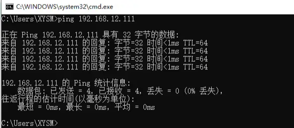
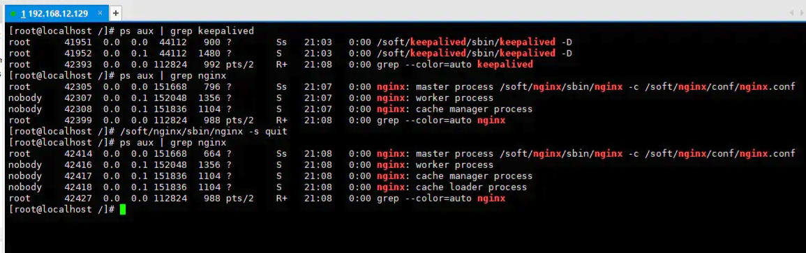
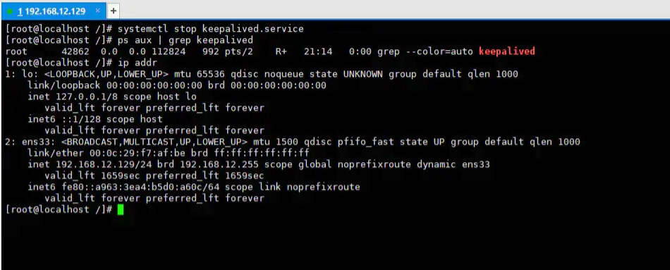
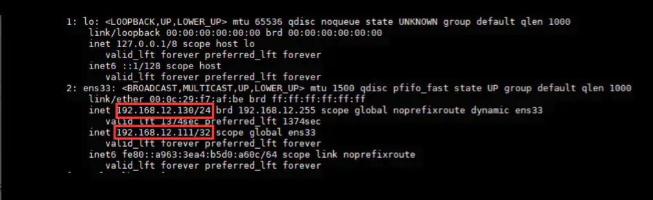

# Nginx学习

> 大部分内容来源于：[万字总结，体系化带你全面认识 Nginx ！](https://juejin.cn/post/6942607113118023710)

## 1. 安装

### yum安装

```bash
$ sudo yum -y install nginx   # 安装 nginx
$ sudo yum remove nginx  # 卸载 nginx
```

使用 yum 进行 Nginx 安装时，Nginx 配置文件在 `/etc/nginx` 目录下。也通过 `rpm -ql nginx` 命令查看 `Nginx` 的安装信息。

```text
# Nginx配置文件
/etc/nginx/nginx.conf # nginx 主配置文件
/etc/nginx/nginx.conf.default

# 可执行程序文件
/usr/bin/nginx-upgrade
/usr/sbin/nginx

# nginx库文件
/usr/lib/systemd/system/nginx.service # 用于配置系统守护进程
/usr/lib64/nginx/modules # Nginx模块目录

# 帮助文档
/usr/share/doc/nginx-1.16.1
/usr/share/doc/nginx-1.16.1/CHANGES
/usr/share/doc/nginx-1.16.1/README
/usr/share/doc/nginx-1.16.1/README.dynamic
/usr/share/doc/nginx-1.16.1/UPGRADE-NOTES-1.6-to-1.10

# 静态资源目录
/usr/share/nginx/html/404.html
/usr/share/nginx/html/50x.html
/usr/share/nginx/html/index.html

# 存放Nginx日志文件
/var/log/nginx
```

主要关注的文件夹有两个：

1. `/etc/nginx/conf.d/` 是子配置项存放处， `/etc/nginx/nginx.conf` 主配置文件会默认把这个文件夹中所有子配置项都引入；
2. `/usr/share/nginx/html/` 静态文件都放在这个文件夹，也可以根据你自己的习惯放在其他地方

### docker安装

```bash
docker run --name nginx -p 8100:80 -v D:/Code/data/nginx/nginx.conf:/etc/nginx/nginx.conf -v D:/Code/data/nginx/conf.d:/etc/nginx/conf.d -d nginx
```


## 2. Nginx 常用命令

`systemctl` 系统命令：

```bash
# 开机配置
systemctl enable nginx # 开机自动启动
systemctl disable nginx # 关闭开机自动启动

# 启动Nginx
systemctl start nginx # 启动Nginx成功后，可以直接访问主机IP，此时会展示Nginx默认页面

# 停止Nginx
systemctl stop nginx

# 重启Nginx
systemctl restart nginx

# 重新加载Nginx
systemctl reload nginx

# 查看 Nginx 运行状态
systemctl status nginx

# 查看Nginx进程
ps -ef | grep nginx

# 杀死Nginx进程
kill -9 pid # 根据上面查看到的Nginx进程号，杀死Nginx进程，-9 表示强制结束进程
```

`Nginx` 应用程序命令

```text
nginx -s reload  # 向主进程发送信号，重新加载配置文件，热重启
nginx -s reopen	 # 重启 Nginx
nginx -s stop    # 快速关闭
nginx -s quit    # 等待工作进程处理完成后关闭
nginx -T         # 查看当前 Nginx 最终的配置
nginx -t         # 检查配置是否有问题
```

## 3. Nginx 配置文件详解

### 3.1 主要结构

```bash
# main段配置信息
user  nginx;                        # 运行用户，默认即是nginx，可以不进行设置
worker_processes  auto;             # Nginx 进程数，一般设置为和 CPU 核数一样
error_log  /var/log/nginx/error.log warn;   # Nginx 的错误日志存放目录
pid        /var/run/nginx.pid;      # Nginx 服务启动时的 pid 存放位置

# events段配置信息
events {
    use epoll;     # 使用epoll的I/O模型(如果你不知道Nginx该使用哪种轮询方法，会自动选择一个最适合你操作系统的)
    worker_connections 1024;   # 每个进程允许最大并发数
}

# http段配置信息
# 配置使用最频繁的部分，代理、缓存、日志定义等绝大多数功能和第三方模块的配置都在这里设置
http { 
    # 设置日志模式
    log_format  main  '$remote_addr - $remote_user [$time_local] "$request" '
                      '$status $body_bytes_sent "$http_referer" '
                      '"$http_user_agent" "$http_x_forwarded_for"';

    access_log  /var/log/nginx/access.log  main;   # Nginx访问日志存放位置

    sendfile            on;   # 开启高效传输模式
    tcp_nopush          on;   # 减少网络报文段的数量
    tcp_nodelay         on;
    keepalive_timeout   65;   # 保持连接的时间，也叫超时时间，单位秒
    types_hash_max_size 2048;

    include             /etc/nginx/mime.types;      # 文件扩展名与类型映射表
    default_type        application/octet-stream;   # 默认文件类型

    include /etc/nginx/conf.d/*.conf;   # 加载子配置项
    
    # server段配置信息
    server {
    	listen       80;       # 配置监听的端口
    	server_name  localhost;    # 配置的域名
      
    	# location段配置信息
    	location / {
    		root   /usr/share/nginx/html;  # 网站根目录
    		index  index.html index.htm;   # 默认首页文件
    		deny 172.168.22.11;   # 禁止访问的ip地址，可以为all
    		allow 172.168.33.44；# 允许访问的ip地址，可以为all
    	}
    	
    	error_page 500 502 503 504 /50x.html;  # 默认50x对应的访问页面
    	error_page 400 404 error.html;   # 同上
    }
}
```

`main` 全局配置，对全局生效；

`events` 配置影响 `Nginx` 服务器与用户的网络连接；

`http` 配置代理，缓存，日志定义等绝大多数功能和第三方模块的配置；

`server` 配置虚拟主机的相关参数，一个 `http` 块中可以有多个 `server` 块；

`location` 用于配置匹配的 `uri` ；

`upstream` 配置后端服务器具体地址，负载均衡配置不可或缺的部分；

下图能清晰的展示它的层级结构：


### 3.2 main 段核心参数

#### user

指定运行 `Nginx` 的 `woker` 子进程的属主和属组，其中组可以不指定。

```bash
user USERNAME [GROUP]

user nginx lion; # 用户是nginx;组是lion

```

#### pid

指定运行 `Nginx` `master` 主进程的 `pid` 文件存放路径。

```bash
pid /opt/nginx/logs/nginx.pid # master主进程的的pid存放在nginx.pid的文件

```

#### worker_rlimit_nofile_number

指定 `worker` 子进程可以打开的最大文件句柄数。

```bash
worker_rlimit_nofile 20480; # 可以理解成每个worker子进程的最大连接数量。

```

#### worker_rlimit_core

指定 `worker` 子进程异常终止后的 `core` 文件，用于记录分析问题。

```bash
worker_rlimit_core 50M; # 存放大小限制
working_directory /opt/nginx/tmp; # 存放目录

```

#### worker_processes_number

指定 `Nginx` 启动的 `worker` 子进程数量。

```bash
worker_processes 4; # 指定具体子进程数量
worker_processes auto; # 与当前cpu物理核心数一致

```

#### worker_cpu_affinity

将每个 `worker` 子进程与我们的 `cpu` 物理核心绑定。

```bash
worker_cpu_affinity 0001 0010 0100 1000; # 4个物理核心，4个worker子进程

```


将每个 `worker` 子进程与特定 `CPU` 物理核心绑定，优势在于，避免同一个 `worker` 子进程在不同的 `CPU` 核心上切换，缓存失效，降低性能。但其并不能真正的避免进程切换。

#### worker_priority

指定 `worker` 子进程的 `nice` 值，以调整运行 `Nginx` 的优先级，通常设定为负值，以优先调用 `Nginx` 。

```bash
worker_priority -10; # 120-10=110，110就是最终的优先级

```

`Linux` 默认进程的优先级值是120，值越小越优先； `nice` 定范围为 `-20` 到 `+19` 。

[备注] 应用的默认优先级值是120加上 `nice` 值等于它最终的值，这个值越小，优先级越高。

#### worker_shutdown_timeout

指定 `worker` 子进程优雅退出时的超时时间。

```bash
worker_shutdown_timeout 5s;

```

#### timer_resolution

`worker` 子进程内部使用的计时器精度，调整时间间隔越大，系统调用越少，有利于性能提升；反之，系统调用越多，性能下降。

```bash
timer_resolution 100ms;

```

在 `Linux` 系统中，用户需要获取计时器时需要向操作系统内核发送请求，有请求就必然会有开销，因此这个间隔越大开销就越小。

#### daemon

指定 `Nginx` 的运行方式，前台还是后台，前台用于调试，后台用于生产。

```bash
daemon off; # 默认是on，后台运行模式
```

### 3.3 events 段核心参数

#### use

`Nginx` 使用何种事件驱动模型。

```bash
use method; # 不推荐配置它，让nginx自己选择

method 可选值为：select、poll、kqueue、epoll、/dev/poll、eventport

```

#### worker_connections

`worker` 子进程能够处理的最大并发连接数。

```bash
worker_connections 1024 # 每个子进程的最大连接数为1024

```

#### accept_mutex

是否打开负载均衡互斥锁。

```bash
accept_mutex on # 默认是off关闭的，这里推荐打开
```

### 3.4 upstream

用于定义上游服务器（指的就是后台提供的应用服务器）的相关信息。


```bash
语法：upstream name {
	...
}

上下文：http

示例：
upstream back_end_server{
  server 192.168.100.33:8081
}

```

在 `upstream` 内可使用的指令：

- `server` 定义上游服务器地址；
- `zone` 定义共享内存，用于跨 `worker` 子进程；
- `keepalive` 对上游服务启用长连接；
- `keepalive_requests` 一个长连接最多请求 `HTTP` 的个数；
- `keepalive_timeout` 空闲情形下，一个长连接的超时时长；
- `hash` 哈希负载均衡算法；
- `ip_hash` 依据 `IP` 进行哈希计算的负载均衡算法；
- `least_conn` 最少连接数负载均衡算法；
- `least_time` 最短响应时间负载均衡算法；
- `random` 随机负载均衡算法；

#### server

定义上游服务器地址。

```bash
语法：server address [parameters]

上下文：upstream

```

`parameters` 可选值：

- `weight=number` 权重值，默认为1；
- `max_conns=number` 上游服务器的最大并发连接数；
- `fail_timeout=time` 服务器不可用的判定时间；
- `max_fails=numer` 服务器不可用的检查次数；
- `backup` 备份服务器，仅当其他服务器都不可用时才会启用；
- `down` 标记服务器长期不可用，离线维护；

#### keepalive

限制每个 `worker` 子进程与上游服务器空闲长连接的最大数量。

```bash
keepalive connections;

上下文：upstream

示例：keepalive 16;

```

#### keepalive_requests

单个长连接可以处理的最多 `HTTP` 请求个数。

```bash
语法：keepalive_requests number;

默认值：keepalive_requests 100;

上下文：upstream

```

#### keepalive_timeout

空闲长连接的最长保持时间。

```bash
语法：keepalive_timeout time;

默认值：keepalive_timeout 60s;

上下文：upstream

```

#### 配置实例

```bash
upstream back_end{
	server 127.0.0.1:8081 weight=3 max_conns=1000 fail_timeout=10s max_fails=2;
  keepalive 32;
  keepalive_requests 50;
  keepalive_timeout 30s;
}
```

#### 配置负载均衡

配置负载均衡主要是要使用 `upstream` 指令。默认的负载均衡策略为轮询策略。还有其它分发策略如下。

**hash 算法**

通过制定关键字作为 `hash key` ，基于 `hash` 算法映射到特定的上游服务器中。关键字可以包含有变量、字符串。

```bash
upstream demo_server {
  hash $request_uri;
  server 121.42.11.34:8020;
  server 121.42.11.34:8030;
  server 121.42.11.34:8040;
}

server {
  listen 80;
  server_name balance.lion.club;
  
  location /balance/ {
  	proxy_pass http://demo_server;
  }
}

```

`hash $request_uri` 表示使用 `request_uri` 变量作为 `hash` 的 `key` 值，只要访问的 `URI` 保持不变，就会一直分发给同一台服务器。

**ip_hash**

根据客户端的请求 `ip` 进行判断，只要 `ip` 地址不变就永远分配到同一台主机。它可以有效解决后台服务器 `session` 保持的问题。

```bash
upstream demo_server {
  ip_hash;
  server 121.42.11.34:8020;
  server 121.42.11.34:8030;
  server 121.42.11.34:8040;
}

server {
  listen 80;
  server_name balance.lion.club;
  
  location /balance/ {
  	proxy_pass http://demo_server;
  }
}

```

**最少连接数算法**

各个 `worker` 子进程通过读取共享内存的数据，来获取后端服务器的信息。来挑选一台当前已建立连接数最少的服务器进行分配请求。

```bash
语法：least_conn;

上下文：upstream;

```

示例：

```bash
upstream demo_server {
  zone test 10M; # zone可以设置共享内存空间的名字和大小
  least_conn;
  server 121.42.11.34:8020;
  server 121.42.11.34:8030;
  server 121.42.11.34:8040;
}

server {
  listen 80;
  server_name balance.lion.club;
  
  location /balance/ {
  	proxy_pass http://demo_server;
  }
}
```

### 3.5 server段核心参数

#### server_name 指令

指定虚拟主机域名。

```bash
server_name name1 name2 name3

# 示例：
server_name www.nginx.com;

```

域名匹配的四种写法：

- 精确匹配： `server_name www.nginx.com` ;
- 左侧通配： `server_name *.nginx.com` ;
- 右侧统配： `server_name  www.nginx.*` ;
- 正则匹配： `server_name ~^www\.nginx\.*$` ;

匹配优先级：**精确匹配 > 左侧通配符匹配 > 右侧通配符匹配 > 正则表达式匹配**

`server_name` 配置实例：

1、配置本地  `DNS` 解析 `vim /etc/hosts` （ `macOS` 系统）

```bash
# 添加如下内容，其中 121.42.11.34 是阿里云服务器IP地址
121.42.11.34 www.nginx-test.com
121.42.11.34 mail.nginx-test.com
121.42.11.34 www.nginx-test.org
121.42.11.34 doc.nginx-test.com
121.42.11.34 www.nginx-test.cn
121.42.11.34 fe.nginx-test.club

```

[注意] 这里使用的是虚拟域名进行测试，因此需要配置本地 `DNS` 解析，如果使用阿里云上购买的域名，则需要在阿里云上设置好域名解析。

2、配置阿里云 `Nginx` ，`vim /etc/nginx/nginx.conf` 

```bash
# 这里只列举了http端中的sever端配置

# 左匹配
server {
	listen	80;
	server_name	*.nginx-test.com;
	root	/usr/share/nginx/html/nginx-test/left-match/;
	location / {
		index index.html;
	}
}

# 正则匹配
server {
	listen	80;
	server_name	~^.*\.nginx-test\..*$;
	root	/usr/share/nginx/html/nginx-test/reg-match/;
	location / {
		index index.html;
	}
}

# 右匹配
server {
	listen	80;
	server_name	www.nginx-test.*;
	root	/usr/share/nginx/html/nginx-test/right-match/;
	location / {
		index index.html;
	}
}

# 完全匹配
server {
	listen	80;
	server_name	www.nginx-test.com;
	root	/usr/share/nginx/html/nginx-test/all-match/;
	location / {
		index index.html;
	}
}

```

3、访问分析

- 当访问 `www.nginx-test.com` 时，都可以被匹配上，因此选择优先级最高的“完全匹配”；
- 当访问 `mail.nginx-test.com` 时，会进行“左匹配”；
- 当访问 `www.nginx-test.org` 时，会进行“右匹配”；
- 当访问 `doc.nginx-test.com` 时，会进行“左匹配”；
- 当访问 `www.nginx-test.cn` 时，会进行“右匹配”；
- 当访问 `fe.nginx-test.club` 时，会进行“正则匹配”；

#### root

指定静态资源目录位置，它可以写在 `http` 、 `server` 、 `location` 等配置中。

```bash
root path

例如：
location /image {
	root /opt/nginx/static;
}

当用户访问 www.test.com/image/1.png 时，实际在服务器找的路径是 /opt/nginx/static/image/1.png

```

[注意] `root` 会将定义路径与 `URI` 叠加， `alias` 则只取定义路径。

#### alias

它也是指定静态资源目录位置，它只能写在 `location` 中。

```bash
location /image {
	alias /opt/nginx/static/image/;
}

当用户访问 www.test.com/image/1.png 时，实际在服务器找的路径是 /opt/nginx/static/image/1.png

```

[注意] 使用 alias 末尾一定要添加 `/` ，并且它只能位于 `location` 中。

#### location

配置路径。

```bash
location [ = | ~ | ~* | ^~ ] uri {
	...
}

```

匹配规则：

- `=` 精确匹配；
- `~` 正则匹配，区分大小写；
- `~*` 正则匹配，不区分大小写；
- `^~` 匹配到即停止搜索；


匹配优先级： `=` > `^~` >  `~` > `~*` > 不带任何字符。

实例：

```bash
server {
  listen	80;
  server_name	www.nginx-test.com;
  
  # 只有当访问 www.nginx-test.com/match_all/ 时才会匹配到/usr/share/nginx/html/match_all/index.html
  location = /match_all/ {
      root	/usr/share/nginx/html
      index index.html
  }
  
  # 当访问 www.nginx-test.com/1.jpg 等路径时会去 /usr/share/nginx/images/1.jpg 找对应的资源
  location ~ \.(jpeg|jpg|png|svg)$ {
  	root /usr/share/nginx/images;
  }
  
  # 当访问 www.nginx-test.com/bbs/ 时会匹配上 /usr/share/nginx/html/bbs/index.html
  location ^~ /bbs/ {
  	root /usr/share/nginx/html;
    index index.html index.htm;
  }
}

```

**location 中的反斜线**

```bash
location /test {
	...
}

location /test/ {
	...
}

```

- 不带 `/` 当访问 `www.nginx-test.com/test` 时， `Nginx` 先找是否有 `test` 目录，如果有则找 `test` 目录下的 `index.html` ；如果没有 `test` 目录， `nginx` 则会找是否有 `test` 文件。
- 带 `/` 当访问 `www.nginx-test.com/test` 时， `Nginx` 先找是否有 `test` 目录，如果有则找 `test` 目录下的 `index.html` ，如果没有它也不会去找是否存在 `test` 文件。

#### return

停止处理请求，直接返回响应码或重定向到其他 `URL` ；执行 `return` 指令后， `location` 中后续指令将不会被执行。

```bash
return code [text];
return code URL;
return URL;

例如：
location / {
	return 404; # 直接返回状态码
}

location / {
	return 404 "pages not found"; # 返回状态码 + 一段文本
}

location / {
	return 302 /bbs ; # 返回状态码 + 重定向地址
}

location / {
	return https://www.baidu.com ; # 返回重定向地址
}

```

#### rewrite

根据指定正则表达式匹配规则，重写 `URL` 。

```bash
语法：rewrite 正则表达式 要替换的内容 [flag];

上下文：server、location、if

示例：rewirte /images/(.*\.jpg)$ /pic/$1; # $1是前面括号(.*\.jpg)的反向引用

```


`flag` 可选值的含义：

- `last` 重写后的 `URL` 发起新请求，再次进入 `server` 段，重试 `location` 的中的匹配；
- `break` 直接使用重写后的 `URL` ，不再匹配其它 `location` 中语句；
- `redirect` 返回302临时重定向；
- `permanent` 返回301永久重定向；

```bash
server{
  listen 80;
  server_name fe.lion.club; # 要在本地hosts文件进行配置
  root html;
  location /search {
  	rewrite ^/(.*) https://www.baidu.com redirect;
  }
  
  location /images {
  	rewrite /images/(.*) /pics/$1;
  }
  
  location /pics {
  	rewrite /pics/(.*) /photos/$1;
  }
  
  location /photos {
  
  }
}

```

按照这个配置我们来分析：

- 当访问 `fe.lion.club/search` 时，会自动帮我们重定向到 `https://www.baidu.com`。
- 当访问 `fe.lion.club/images/1.jpg` 时，第一步重写 `URL` 为 `fe.lion.club/pics/1.jpg` ，找到 `pics` 的 `location` ，继续重写 `URL` 为 `fe.lion.club/photos/1.jpg` ，找到 `/photos` 的 `location` 后，去 `html/photos` 目录下寻找 `1.jpg` 静态资源。

#### if 指令

```bash
语法：if (condition) {...}

上下文：server、location

示例：
if($http_user_agent ~ Chrome){
  rewrite /(.*)/browser/$1 break;
}

```


`condition` 判断条件：

- `$variable` 仅为变量时，值为空或以0开头字符串都会被当做 `false` 处理；
- `=` 或 `!=` 相等或不等；
- `~` 正则匹配；
- `! ~` 非正则匹配；
- `~*` 正则匹配，不区分大小写；
- `-f` 或 `! -f` 检测文件存在或不存在；
- `-d` 或 `! -d` 检测目录存在或不存在；
- `-e` 或 `! -e` 检测文件、目录、符号链接等存在或不存在；
- `-x` 或 `! -x` 检测文件可以执行或不可执行；


实例：

```bash
server {
  listen 8080;
  server_name localhost;
  root html;
  
  location / {
  	if ( $uri = "/images/" ){
    	rewrite (.*) /pics/ break;
    }
  }
}

```

当访问 `localhost:8080/images/` 时，会进入 `if` 判断里面执行 `rewrite` 命令。

#### autoindex

用户请求以 `/` 结尾时，列出目录结构，可以用于快速搭建静态资源下载网站。

`autoindex.conf` 配置信息：

```bash
server {
  listen 80;
  server_name fe.lion-test.club;
  
  location /download/ {
    root /opt/source;
    
    autoindex on; # 打开 autoindex，，可选参数有 on | off
    autoindex_exact_size on; # 修改为off，以KB、MB、GB显示文件大小，默认为on，以bytes显示出⽂件的确切⼤⼩
    autoindex_format html; # 以html的方式进行格式化，可选参数有 html | json | xml
    autoindex_localtime off; # 显示的⽂件时间为⽂件的服务器时间。默认为off，显示的⽂件时间为GMT时间
  }
}

```

当访问 `fe.lion.com/download/` 时，会把服务器 `/opt/source/download/` 路径下的文件展示出来，如下图所示：


#### proxy_pass

用于配置代理服务器。

```bash
语法：proxy_pass URL;

上下文：location、if、limit_except

示例：
proxy_pass http://127.0.0.1:8081
proxy_pass http://127.0.0.1:8081/proxy
```

`URL` 参数原则

1. `URL` 必须以 `http` 或 `https` 开头；
2. `URL` 中可以携带变量；
3. `URL` 中是否带 `URI` ，会直接影响发往上游请求的 `URL` ；


接下来让我们来看看两种常见的 `URL` 用法：

1. `proxy_pass http://192.168.100.33:8081` 
2. `proxy_pass http://192.168.100.33:8081/`

这两种用法的区别就是带 `/` 和不带 `/` ，在配置代理时它们的区别可大了：

- 不带 `/` 意味着 `Nginx` 不会修改用户 `URL` ，而是直接透传给上游的应用服务器；
- 带 `/` 意味着 `Nginx` 会修改用户 `URL` ，修改方法是将 `location` 后的 `URL` 从用户 `URL` 中删除；


不带 `/` 的用法：

```bash
location /bbs/{
  proxy_pass http://127.0.0.1:8080;
}

```

分析：

1. 用户请求 `URL` ： `/bbs/abc/test.html` 
2. 请求到达 `Nginx` 的 `URL` ： `/bbs/abc/test.html` 
3. 请求到达上游应用服务器的 `URL` ： `/bbs/abc/test.html` 


带 `/` 的用法：

```bash
location /bbs/{
  proxy_pass http://127.0.0.1:8080/;
}

```

分析：

1. 用户请求 `URL` ： `/bbs/abc/test.html` 
2. 请求到达 `Nginx` 的 `URL` ： `/bbs/abc/test.html` 
3. 请求到达上游应用服务器的 `URL` ： `/abc/test.html` 


并没有拼接上 `/bbs` ，这点和 `root` 与 `alias` 之间的区别是保持一致的。

**例如：**

```text
假设下面四种情况分别用 http://192.168.1.188/proxy/test.html 进行访问。
第一种：
location /proxy/ {
	proxy_pass http://127.0.0.1/;
}
代理到URL：http://127.0.0.1/test.html

第二种（相对于第一种，最后少一个 / ）
location /proxy/ {
	proxy_pass http://127.0.0.1;
}
代理到URL：http://127.0.0.1/proxy/test.html

第三种：
location /proxy/ {
	proxy_pass http://127.0.0.1/aaa/;
}
代理到URL：http://127.0.0.1/aaa/test.html

第四种（相对于第三种，最后少一个 / ）
location /proxy/ {
	proxy_pass http://127.0.0.1/aaa;
}

代理到URL：http://127.0.0.1/aaatest.html
```


## 4. 变量

`Nginx` 提供给使用者的变量非常多，但是终究是一个完整的请求过程所产生数据， `Nginx` 将这些数据以变量的形式提供给使用者。

下面列举些项目中常用的变量：

| 变量名               | 含义                                                         |
| -------------------- | ------------------------------------------------------------ |
| `remote_addr`        | 客户端 `IP` 地址                                             |
| `remote_port`        | 客户端端口                                                   |
| `server_addr`        | 服务端 `IP` 地址                                             |
| `server_port`        | 服务端端口                                                   |
| `server_protocol`    | 服务端协议                                                   |
| `binary_remote_addr` | 二进制格式的客户端 `IP` 地址                                 |
| `connection`         | `TCP` 连接的序号，递增                                       |
| `connection_request` | `TCP` 连接当前的请求数量                                     |
| `uri`                | 请求的URL，不包含参数                                        |
| `request_uri`        | 请求的URL，包含参数                                          |
| `scheme`             | 协议名， `http` 或 `https`                                   |
| `request_method`     | 请求方法                                                     |
| `request_length`     | 全部请求的长度，包含请求行、请求头、请求体                   |
| `args`               | 全部参数字符串                                               |
| `arg_参数名`         | 获取特定参数值                                               |
| `is_args`            | `URL` 中是否有参数，有的话返回 `?` ，否则返回空              |
| `query_string`       | 与 `args` 相同                                               |
| `host`               | 请求信息中的 `Host` ，如果请求中没有 `Host` 行，则在请求头中找，最后使用 `nginx` 中设置的 `server_name` 。 |
| `http_user_agent`    | 用户浏览器                                                   |
| `http_referer`       | 从哪些链接过来的请求                                         |
| `http_via`           | 每经过一层代理服务器，都会添加相应的信息                     |
| `http_cookie`        | 获取用户 `cookie`                                            |
| `request_time`       | 处理请求已消耗的时间                                         |
| `https`              | 是否开启了 `https` ，是则返回 `on` ，否则返回空              |
| `request_filename`   | 磁盘文件系统待访问文件的完整路径                             |
| `document_root`      | 由 `URI` 和 `root/alias` 规则生成的文件夹路径                |
| `limit_rate`         | 返回响应时的速度上限值                                       |


## 5. Nginx 应用核心概念

代理是在服务器和客户端之间假设的一层服务器，代理将接收客户端的请求并将它转发给服务器，然后将服务端的响应转发给客户端。

不管是正向代理还是反向代理，实现的都是上面的功能。


### 5.1 正向代理

> 正向代理，意思是一个位于客户端和原始服务器(origin server)之间的服务器，为了从原始服务器取得内容，客户端向代理发送一个请求并指定目标(原始服务器)，然后代理向原始服务器转交请求并将获得的内容返回给客户端。


正向代理是为我们服务的，即为客户端服务的，客户端可以根据正向代理访问到它本身无法访问到的服务器资源。

正向代理对我们是透明的，对服务端是非透明的，即服务端并不知道自己收到的是来自代理的访问还是来自真实客户端的访问。

### 5.2 反向代理

> - 反向代理*（Reverse Proxy）方式是指以代理服务器来接受internet上的连接请求，然后将请求转发给内部网络上的服务器，并将从服务器上得到的结果返回给internet上请求连接的客户端，此时代理服务器对外就表现为一个反向代理服务器。


反向代理是为服务端服务的，反向代理可以帮助服务器接收来自客户端的请求，帮助服务器做请求转发，负载均衡等。

反向代理对服务端是透明的，对我们是非透明的，即我们并不知道自己访问的是代理服务器，而服务器知道反向代理在为他服务。

反向代理的优势：

- 隐藏真实服务器；
- 负载均衡便于横向扩充后端动态服务；
- 动静分离，提升系统健壮性；


那么“动静分离”是什么？负载均衡又是什么？

### 5.3 动静分离

动静分离是指在 `web` 服务器架构中，将静态页面与动态页面或者静态内容接口和动态内容接口分开不同系统访问的架构设计方法，进而提示整个服务的访问性和可维护性。


一般来说，都需要将动态资源和静态资源分开，由于 `Nginx` 的高并发和静态资源缓存等特性，经常将静态资源部署在 `Nginx` 上。如果请求的是静态资源，直接到静态资源目录获取资源，如果是动态资源的请求，则利用反向代理的原理，把请求转发给对应后台应用去处理，从而实现动静分离。

使用前后端分离后，可以很大程度提升静态资源的访问速度，即使动态服务不可用，静态资源的访问也不会受到影响。

### 5.4 负载均衡

一般情况下，客户端发送多个请求到服务器，服务器处理请求，其中一部分可能要操作一些资源比如数据库、静态资源等，服务器处理完毕后，再将结果返回给客户端。

这种模式对于早期的系统来说，功能要求不复杂，且并发请求相对较少的情况下还能胜任，成本也低。随着信息数量不断增长，访问量和数据量飞速增长，以及系统业务复杂度持续增加，这种做法已无法满足要求，并发量特别大时，服务器容易崩。

很明显这是由于服务器性能的瓶颈造成的问题，除了堆机器之外，最重要的做法就是负载均衡。

请求爆发式增长的情况下，单个机器性能再强劲也无法满足要求了，这个时候集群的概念产生了，单个服务器解决不了的问题，可以使用多个服务器，然后将请求分发到各个服务器上，将负载分发到不同的服务器，这就是负载均衡，核心是「分摊压力」。 `Nginx` 实现负载均衡，一般来说指的是将请求转发给服务器集群。

举个具体的例子，晚高峰乘坐地铁的时候，入站口经常会有地铁工作人员大喇叭“请走 `B` 口， `B` 口人少车空....”，这个工作人员的作用就是负载均衡。


`Nginx` 实现负载均衡的策略：

- 轮询策略：默认情况下采用的策略，将所有客户端请求轮询分配给服务端。这种策略是可以正常工作的，但是如果其中某一台服务器压力太大，出现延迟，会影响所有分配在这台服务器下的用户。
- 最小连接数策略：将请求优先分配给压力较小的服务器，它可以平衡每个队列的长度，并避免向压力大的服务器添加更多的请求。
- 最快响应时间策略：优先分配给响应时间最短的服务器。
- 客户端 `ip` 绑定策略：来自同一个 `ip` 的请求永远只分配一台服务器，有效解决了动态网页存在的 `session` 共享问题。

## 6. 配置缓存

缓存可以非常有效的提升性能，因此不论是客户端（浏览器），还是代理服务器（ `Nginx` ），乃至上游服务器都多少会涉及到缓存。可见缓存在每个环节都是非常重要的。下面让我们来学习 `Nginx` 中如何设置缓存策略。

### proxy_cache

存储一些之前被访问过、而且可能将要被再次访问的资源，使用户可以直接从代理服务器获得，从而减少上游服务器的压力，加快整个访问速度。

```bash
语法：proxy_cache zone | off ; # zone 是共享内存的名称

默认值：proxy_cache off;

上下文：http、server、location

```

### proxy_cache_path

设置缓存文件的存放路径。

```bash
语法：proxy_cache_path path [levels=levels] [use_temp_path=on|off] keys_zone=name:size [inactive=time] [max_size=size] [manager_files=number] [manager_sleep=time] [manager_threshold=time] [loader_files=number] [loader_sleep=time] [loader_threshold=time] [purger=on|off] [purger_files=number] [purger_sleep=time] [purger_threshold=time];

默认值：proxy_cache_path off

上下文：http

```

参数含义：

- `path`：缓存的路径地址。
- `levels`：缓存存储的层次结构，最多允许三层目录。
- `use_temp_path`：是否使用临时目录。
- `keys_zone`：指定一个共享内存空间来存储热点`Key`(`1M`可存储`8000`个`Key`)。
- `inactive`：设置缓存多长时间未被访问后删除（默认是十分钟）。
- `max_size`：允许缓存的最大存储空间，超出后会基于`LRU`算法移除缓存，`Nginx`会创建一个`Cache manager`的进程移除数据，也可以通过`purge`方式。
- `manager_files`：`manager`进程每次移除缓存文件数量的上限。
- `manager_sleep`：`manager`进程每次移除缓存文件的时间上限。
- `manager_threshold`：`manager`进程每次移除缓存后的间隔时间。
- `loader_files`：重启`Nginx`载入缓存时，每次加载的个数，默认`100`。
- `loader_sleep`：每次载入时，允许的最大时间上限，默认`200ms`。
- `loader_threshold`：一次载入后，停顿的时间间隔，默认`50ms`。
- `purger`：是否开启`purge`方式移除数据。
- `purger_files`：每次移除缓存文件时的数量。
- `purger_sleep`：每次移除时，允许消耗的最大时间。
- `purger_threshold`：每次移除完成后，停顿的间隔时间。

### proxy_cache_key

设置缓存文件的 `key` 。

```bash
语法：proxy_cache_key

默认值：proxy_cache_key $scheme$proxy_host$request_uri;

上下文：http、server、location

```

### proxy_cache_valid

配置什么状态码可以被缓存，以及缓存时长。

```bash
语法：proxy_cache_valid [code...] time;

上下文：http、server、location

配置示例：proxy_cache_valid 200 304 2m;; # 说明对于状态为200和304的缓存文件的缓存时间是2分钟

```

### proxy_no_cache

定义相应保存到缓存的条件，如果字符串参数的至少一个值不为空且不等于“ 0”，则将不保存该响应到缓存。

```bash
语法：proxy_no_cache string;

上下文：http、server、location

示例：proxy_no_cache $http_pragma    $http_authorization;

```

### proxy_cache_bypass

定义条件，在该条件下将不会从缓存中获取响应。

```bash
语法：proxy_cache_bypass string;

上下文：http、server、location

示例：proxy_cache_bypass $http_pragma    $http_authorization;

```

### upstream_cache_status 变量

它存储了缓存是否命中的信息，会设置在响应头信息中，在调试中非常有用。

```bash
MISS: 未命中缓存
HIT： 命中缓存
EXPIRED: 缓存过期
STALE: 命中了陈旧缓存
REVALIDDATED: Nginx验证陈旧缓存依然有效
UPDATING: 内容陈旧，但正在更新
BYPASS: X响应从原始服务器获取
```

### 配置实例

我们把 `121.42.11.34` 服务器作为上游服务器，做如下配置（ `/etc/nginx/conf.d/cache.conf` ）：

```bash
server {
  listen 1010;
  root /usr/share/nginx/html/1010;
  location / {
  	index index.html;
  }
}

server {
  listen 1020;
  root /usr/share/nginx/html/1020;
  location / {
  	index index.html;
  }
}

```

把 `121.5.180.193` 服务器作为代理服务器，做如下配置（ `/etc/nginx/conf.d/cache.conf` ）：

```bash
proxy_cache_path /etc/nginx/cache_temp levels=2:2 keys_zone=cache_zone:30m max_size=2g inactive=60m use_temp_path=off;

upstream cache_server{
  server 121.42.11.34:1010;
  server 121.42.11.34:1020;
}

server {
  listen 80;
  server_name cache.lion.club;
  location / {
    proxy_cache cache_zone; # 设置缓存内存，上面配置中已经定义好的
    proxy_cache_valid 200 5m; # 缓存状态为200的请求，缓存时长为5分钟
    proxy_cache_key $request_uri; # 缓存文件的key为请求的URI
    add_header Nginx-Cache-Status $upstream_cache_status # 把缓存状态设置为头部信息，响应给客户端
    proxy_pass http://cache_server; # 代理转发
  }
}

```

缓存就是这样配置，我们可以在 `/etc/nginx/cache_temp` 路径下找到相应的缓存文件。

**对于一些实时性要求非常高的页面或数据来说，就不应该去设置缓存，下面来看看如何配置不缓存的内容。**

```bash
...

server {
  listen 80;
  server_name cache.lion.club;
  # URI 中后缀为 .txt 或 .text 的设置变量值为 "no cache"
  if ($request_uri ~ \.(txt|text)$) {
  	set $cache_name "no cache"
  }
  
  location / {
    proxy_no_cache $cache_name; # 判断该变量是否有值，如果有值则不进行缓存，如果没有值则进行缓存
    proxy_cache cache_zone; # 设置缓存内存
    proxy_cache_valid 200 5m; # 缓存状态为200的请求，缓存时长为5分钟
    proxy_cache_key $request_uri; # 缓存文件的key为请求的URI
    add_header Nginx-Cache-Status $upstream_cache_status # 把缓存状态设置为头部信息，响应给客户端
    proxy_pass http://cache_server; # 代理转发
  }
}
```

## 7. 配置HTTPS

在学习如何配置 `HTTPS` 之前，我们先来简单回顾下 `HTTPS` 的工作流程是怎么样的？它是如何进行加密保证安全的？

### HTTPS 工作流程

1. 客户端（浏览器）访问 `https://www.baidu.com` 百度网站；
2. 百度服务器返回 `HTTPS` 使用的 `CA` 证书；
3. 浏览器验证 `CA` 证书是否为合法证书；
4. 验证通过，证书合法，生成一串随机数并使用公钥（证书中提供的）进行加密；
5. 发送公钥加密后的随机数给百度服务器；
6. 百度服务器拿到密文，通过私钥进行解密，获取到随机数（公钥加密，私钥解密，反之也可以）；
7. 百度服务器把要发送给浏览器的内容，使用随机数进行加密后传输给浏览器；
8. 此时浏览器可以使用随机数进行解密，获取到服务器的真实传输内容；

这就是 `HTTPS` 的基本运作原理，使用对称加密和非对称机密配合使用，保证传输内容的安全性。

[关于HTTPS更多知识，可以查看另外一篇文章《学习 HTTP 协议》](https://juejin.cn/post/6844904148601667598#heading-37)。

### 配置证书

下载证书的压缩文件，里面有个 `Nginx` 文件夹，把 `xxx.crt` 和 `xxx.key` 文件拷贝到服务器目录，再进行如下配置：

```bash
server {
  listen 443 ssl http2 default_server;   # SSL 访问端口号为 443
  server_name lion.club;         # 填写绑定证书的域名(我这里是随便写的)
  ssl_certificate /etc/nginx/https/lion.club_bundle.crt;   # 证书地址
  ssl_certificate_key /etc/nginx/https/lion.club.key;      # 私钥地址
  ssl_session_timeout 10m;
  ssl_protocols TLSv1 TLSv1.1 TLSv1.2; # 支持ssl协议版本，默认为后三个，主流版本是[TLSv1.2]
 
  location / {
    root         /usr/share/nginx/html;
    index        index.html index.htm;
  }
}

# ---------HTTP请求转HTTPS-------------
server {
    # 监听HTTP默认的80端口
    listen 80;
    # 如果80端口出现访问该域名的请求
    server_name www.xxx.com;
    # 将请求改写为HTTPS（这里写你配置了HTTPS的域名）
    rewrite ^(.*)$ https://www.xxx.com;
}
```


如此配置后就能正常访问 `HTTPS` 版的网站了。


## 8. Nginx 架构

### 进程结构

多进程结构 `Nginx` 的进程模型图：


多进程中的 `Nginx` 进程架构如下图所示，会有一个父进程（ `Master Process` ），它会有很多子进程（ `Child Processes` ）。

- ```
  Master Process
  ```

   用来管理子进程的，其本身并不真正处理用户请求。

  - 某个子进程 `down` 掉的话，它会向 `Master` 进程发送一条消息，表明自己不可用了，此时 `Master` 进程会去新起一个子进程。
  - 某个配置文件被修改了 `Master` 进程会去通知 `work` 进程获取新的配置信息，这也就是我们所说的热部署。

- 子进程间是通过共享内存的方式进行通信的。

### 配置文件重载原理

`reload` 重载配置文件的流程：

1. 向 `master` 进程发送 `HUP` 信号（ `reload` 命令）；
2. `master` 进程检查配置语法是否正确；
3. `master` 进程打开监听端口；
4. `master` 进程使用新的配置文件启动新的 `worker` 子进程；
5. `master` 进程向老的 `worker` 子进程发送 `QUIT` 信号；
6. 老的 `worker` 进程关闭监听句柄，处理完当前连接后关闭进程；
7. 整个过程 `Nginx` 始终处于平稳运行中，实现了平滑升级，用户无感知；

### Nginx 模块化管理机制

`Nginx` 的内部结构是由核心部分和一系列的功能模块所组成。这样划分是为了使得每个模块的功能相对简单，便于开发，同时也便于对系统进行功能扩展。`Nginx` 的模块是互相独立的,低耦合高内聚。


## 9. Nginx的高可用

  线上如果采用单个节点的方式部署`Nginx`，难免会出现天灾人祸，比如系统异常、程序宕机、服务器断电、机房爆炸、地球毁灭....哈哈哈，夸张了。但实际生产环境中确实存在隐患问题，由于`Nginx`作为整个系统的网关层接入外部流量，所以一旦`Nginx`宕机，最终就会导致整个系统不可用，这无疑对于用户的体验感是极差的，因此也得保障`Nginx`高可用的特性。

> 接下来则会通过`keepalived`的`VIP`机制，实现`Nginx`的高可用。
>  `VIP`并不是只会员的意思，而是指`Virtual IP`，即虚拟`IP`。

`keepalived`在之前单体架构开发时，是一个用的较为频繁的高可用技术，比如`MySQL、Redis、MQ、Proxy、Tomcat`等各处都会通过`keepalived`提供的`VIP`机制，实现单节点应用的高可用。

### Keepalived+重启脚本+双机热备搭建

①首先创建一个对应的目录并下载`keepalived`到`Linux`中并解压：

```shell
[root@localhost]# mkdir /soft/keepalived && cd /soft/keepalived
[root@localhost]# wget https://www.keepalived.org/software/keepalived-2.2.4.tar.gz
[root@localhost]# tar -zxvf keepalived-2.2.4.tar.gz
```

②进入解压后的`keepalived`目录并构建安装环境，然后编译并安装：

```shell
[root@localhost]# cd keepalived-2.2.4
[root@localhost]# ./configure --prefix=/soft/keepalived/
[root@localhost]# make && make install
```

③进入安装目录的`/soft/keepalived/etc/keepalived/`并编辑配置文件：

```shell
[root@localhost]# cd /soft/keepalived/etc/keepalived/
[root@localhost]# vi keepalived.conf
```

④编辑主机的`keepalived.conf`核心配置文件，如下：

```shell
global_defs {
    # 自带的邮件提醒服务，建议用独立的监控或第三方SMTP，也可选择配置邮件发送。
    notification_email {
        root@localhost
    }
    notification_email_from root@localhost
    smtp_server localhost
    smtp_connect_timeout 30
    # 高可用集群主机身份标识(集群中主机身份标识名称不能重复，建议配置成本机IP)
	router_id 192.168.12.129 
}

# 定时运行的脚本文件配置
vrrp_script check_nginx_pid_restart {
    # 之前编写的nginx重启脚本的所在位置
	script "/soft/scripts/keepalived/check_nginx_pid_restart.sh" 
    # 每间隔3秒执行一次
	interval 3
    # 如果脚本中的条件成立，重启一次则权重-20
	weight -20
}

# 定义虚拟路由，VI_1为虚拟路由的标示符（可自定义名称）
vrrp_instance VI_1 {
    # 当前节点的身份标识：用来决定主从（MASTER为主机，BACKUP为从机）
	state MASTER
    # 绑定虚拟IP的网络接口，根据自己的机器的网卡配置
	interface ens33 
    # 虚拟路由的ID号，主从两个节点设置必须一样
	virtual_router_id 121
    # 填写本机IP
	mcast_src_ip 192.168.12.129
    # 节点权重优先级，主节点要比从节点优先级高
	priority 100
    # 优先级高的设置nopreempt，解决异常恢复后再次抢占造成的脑裂问题
	nopreempt
    # 组播信息发送间隔，两个节点设置必须一样，默认1s（类似于心跳检测）
	advert_int 1
    authentication {
        auth_type PASS
        auth_pass 1111
    }
    # 将track_script块加入instance配置块
    track_script {
        # 执行Nginx监控的脚本
		check_nginx_pid_restart
    }

    virtual_ipaddress {
        # 虚拟IP(VIP)，也可扩展，可配置多个。
		192.168.12.111
    }
}
```

⑤克隆一台之前的虚拟机作为从（备）机，编辑从机的`keepalived.conf`文件，如下：

```shell
global_defs {
    # 自带的邮件提醒服务，建议用独立的监控或第三方SMTP，也可选择配置邮件发送。
    notification_email {
        root@localhost
    }
    notification_email_from root@localhost
    smtp_server localhost
    smtp_connect_timeout 30
    # 高可用集群主机身份标识(集群中主机身份标识名称不能重复，建议配置成本机IP)
	router_id 192.168.12.130 
}

# 定时运行的脚本文件配置
vrrp_script check_nginx_pid_restart {
    # 之前编写的nginx重启脚本的所在位置
	script "/soft/scripts/keepalived/check_nginx_pid_restart.sh" 
    # 每间隔3秒执行一次
	interval 3
    # 如果脚本中的条件成立，重启一次则权重-20
	weight -20
}

# 定义虚拟路由，VI_1为虚拟路由的标示符（可自定义名称）
vrrp_instance VI_1 {
    # 当前节点的身份标识：用来决定主从（MASTER为主机，BACKUP为从机）
	state BACKUP
    # 绑定虚拟IP的网络接口，根据自己的机器的网卡配置
	interface ens33 
    # 虚拟路由的ID号，主从两个节点设置必须一样
	virtual_router_id 121
    # 填写本机IP
	mcast_src_ip 192.168.12.130
    # 节点权重优先级，主节点要比从节点优先级高
	priority 90
    # 优先级高的设置nopreempt，解决异常恢复后再次抢占造成的脑裂问题
	nopreempt
    # 组播信息发送间隔，两个节点设置必须一样，默认1s（类似于心跳检测）
	advert_int 1
    authentication {
        auth_type PASS
        auth_pass 1111
    }
    # 将track_script块加入instance配置块
    track_script {
        # 执行Nginx监控的脚本
		check_nginx_pid_restart
    }

    virtual_ipaddress {
        # 虚拟IP(VIP)，也可扩展，可配置多个。
		192.168.12.111
    }
}
```

⑥新建`scripts`目录并编写`Nginx`的重启脚本，`check_nginx_pid_restart.sh`：

```shell
[root@localhost]# mkdir /soft/scripts /soft/scripts/keepalived
[root@localhost]# touch /soft/scripts/keepalived/check_nginx_pid_restart.sh
[root@localhost]# vi /soft/scripts/keepalived/check_nginx_pid_restart.sh

#!/bin/sh
# 通过ps指令查询后台的nginx进程数，并将其保存在变量nginx_number中
nginx_number=`ps -C nginx --no-header | wc -l`
# 判断后台是否还有Nginx进程在运行
if [ $nginx_number -eq 0 ];then
    # 如果后台查询不到`Nginx`进程存在，则执行重启指令
    /soft/nginx/sbin/nginx -c /soft/nginx/conf/nginx.conf
    # 重启后等待1s后，再次查询后台进程数
    sleep 1
    # 如果重启后依旧无法查询到nginx进程
    if [ `ps -C nginx --no-header | wc -l` -eq 0 ];then
        # 将keepalived主机下线，将虚拟IP漂移给从机，从机上线接管Nginx服务
        systemctl stop keepalived.service
    fi
fi
```

⑦编写的脚本文件需要更改编码格式，并赋予执行权限，否则可能执行失败：

```shell
[root@localhost]# vi /soft/scripts/keepalived/check_nginx_pid_restart.sh

:set fileformat=unix # 在vi命令里面执行，修改编码格式
:set ff # 查看修改后的编码格式

[root@localhost]# chmod +x /soft/scripts/keepalived/check_nginx_pid_restart.sh
```

⑧由于安装`keepalived`时，是自定义的安装位置，因此需要拷贝一些文件到系统目录中：

```shell
[root@localhost]# mkdir /etc/keepalived/
[root@localhost]# cp /soft/keepalived/etc/keepalived/keepalived.conf /etc/keepalived/
[root@localhost]# cp /soft/keepalived/keepalived-2.2.4/keepalived/etc/init.d/keepalived /etc/init.d/
[root@localhost]# cp /soft/keepalived/etc/sysconfig/keepalived /etc/sysconfig/
```

⑨将`keepalived`加入系统服务并设置开启自启动，然后测试启动是否正常：

```shell
[root@localhost]# chkconfig keepalived on
[root@localhost]# systemctl daemon-reload
[root@localhost]# systemctl enable keepalived.service
[root@localhost]# systemctl start keepalived.service

其他命令：
systemctl disable keepalived.service # 禁止开机自动启动
systemctl restart keepalived.service # 重启keepalived
systemctl stop keepalived.service # 停止keepalived
tail -f /var/log/messages # 查看keepalived运行时日志
```

⑩最后测试一下`VIP`是否生效，通过查看本机是否成功挂载虚拟`IP`：

```shell
[root@localhost]# ip addr
```


> 从上图中可以明显看见虚拟`IP`已经成功挂载，但另外一台机器`192.168.12.130`并不会挂载这个虚拟`IP`，只有当主机下线后，作为从机的`192.168.12.130`才会上线，接替`VIP`。最后测试一下外网是否可以正常与`VIP`通信，即在`Windows`中直接`ping VIP`：



外部通过`VIP`通信时，也可以正常`Ping`通，代表虚拟`IP`配置成功。

### Nginx高可用性测试

  经过上述步骤后，`keepalived`的`VIP`机制已经搭建成功，在上个阶段中主要做了几件事：

- 一、为部署`Nginx`的机器挂载了`VIP`。
- 二、通过`keepalived`搭建了主从双机热备。
- 三、通过`keepalived`实现了`Nginx`宕机重启。

由于前面没有域名的原因，因此最初`server_name`配置的是当前机器的`IP`，所以需稍微更改一下`nginx.conf`的配置：

```shell
sever{
    listen    80;
    # 这里从机器的本地IP改为虚拟IP
	server_name 192.168.12.111;
	# 如果这里配置的是域名，那么则将域名的映射配置改为虚拟IP
}
```

最后来实验一下效果： 



> 在上述过程中，首先分别启动了`keepalived、nginx`服务，然后通过手动停止`nginx`的方式模拟了`Nginx`宕机情况，过了片刻后再次查询后台进程，我们会发现`nginx`依旧存活。

从这个过程中不难发现，`keepalived`已经为我们实现了`Nginx`宕机后自动重启的功能，那么接着再模拟一下服务器出现故障时的情况：


> 在上述过程中，我们通过手动关闭`keepalived`服务模拟了机器断电、硬件损坏等情况（因为机器断电等情况=主机中的`keepalived`进程消失），然后再次查询了一下本机的`IP`信息，很明显会看到`VIP`消失了！

现在再切换到另外一台机器：`192.168.12.130`来看看情况： 



> 此刻我们会发现，在主机`192.168.12.129`宕机后，VIP自动从主机飘移到了从机`192.168.12.130`上，而此时客户端的请求就最终会来到`130`这台机器的`Nginx`上。

**最终，利用`Keepalived`对`Nginx`做了主从热备之后，无论是遇到线上宕机还是机房断电等各类故障时，都能够确保应用系统能够为用户提供`7x24`小时服务。**


## 10. nginx执行步骤

nginx在处理每一个用户请求时，都是按照若干个不同的阶段依次处理的，与配置文件上的顺序没有关系，详细内容可以阅读《深入理解nginx:模块开发与架构解析》这本书，这里只做简单介绍；

（1）post-read

读取请求内容阶段，nginx读取并解析完请求头之后就立即开始运行；

（2）server-rewrite

server请求地址重写阶段；

（3）find-config

配置查找阶段，用来完成当前请求与location配重块之间的配对工作；

（4）rewrite

location请求地址重写阶段，当ngx_rewrite指令用于location中，就是再这个阶段运行的；

（5）post-rewrite

请求地址重写提交阶段，当nginx完成rewrite阶段所要求的内部跳转动作，如果rewrite阶段有这个要求的话；

（6）preaccess

访问权限检查准备阶段，ngx_limit_req和ngx_limit_zone在这个阶段运行，ngx_limit_req可以控制请求的访问频率，ngx_limit_zone可以控制访问的并发度；

（7）access

权限检查阶段，ngx_access在这个阶段运行，配置指令多是执行访问控制相关的任务，如检查用户的访问权限，检查用户的来源IP是否合法；

（8）post-access

访问权限检查提交阶段；

（9）try-files

配置项try_files处理阶段；

（10）content

内容产生阶段，是所有请求处理阶段中最为重要的阶段，因为这个阶段的指令通常是用来生成HTTP响应内容的；

（11）log

日志模块处理阶段；


图：Nginx 模块执行顺序与阶段

## 11. ngx_lua 运行指令

ngx_lua属于nginx的一部分，它的执行指令都包含在nginx的11个步骤之中了，相应的处理阶段可以做插入式处理，即可插拔式架构，不过ngx_lua并不是所有阶段都会运行的；另外指令可以在http、server、server if、location、location if几个范围进行配置：

| 指令                                           | 所处处理阶段         | 使用范围                              | 解释                                                         |
| :--------------------------------------------- | :------------------- | :------------------------------------ | :----------------------------------------------------------- |
| init_by_lua init_by_lua_file                   | loading-config       | http                                  | nginx Master进程加载配置时执行； 通常用于初始化全局配置/预加载Lua模块 |
| init_worker_by_lua init_worker_by_lua_file     | starting-worker      | http                                  | 每个Nginx Worker进程启动时调用的计时器，如果Master进程不允许则只会在init_by_lua之后调用； 通常用于定时拉取配置/数据，或者后端服务的健康检查 |
| set_by_lua set_by_lua_file                     | rewrite              | server,server if,location,location if | 设置nginx变量，可以实现复杂的赋值逻辑；此处是阻塞的，Lua代码要做到非常快； |
| rewrite_by_lua rewrite_by_lua_file             | rewrite tail         | http,server,location,location if      | rrewrite阶段处理，可以实现复杂的转发/重定向逻辑；            |
| access_by_lua access_by_lua_file               | access tail          | http,server,location,location if      | 请求访问阶段处理，用于访问控制                               |
| content_by_lua content_by_lua_file             | content              | location，location if                 | 内容处理器，接收请求处理并输出响应                           |
| header_filter_by_lua header_filter_by_lua_file | output-header-filter | http，server，location，location if   | 设置header和cookie                                           |
| body_filter_by_lua body_filter_by_lua_file     | output-body-filter   | http，server，location，location if   | 对响应数据进行过滤，比如截断、替换。                         |
| log_by_lua log_by_lua_file                     | log                  | http，server，location，location if   | log阶段处理，比如记录访问量/统计平均响应时间                 |


## 参考

- [万字总结，体系化带你全面认识 Nginx ！](https://juejin.cn/post/6942607113118023710)
- [Nginx中文文档 gitbook](https://wizardforcel.gitbooks.io/nginx-doc/content/index.html)
- [Nginx中文文档](https://blog.redis.com.cn/doc/)
- [Nginx一网打尽：动静分离、压缩、缓存、黑白名单、跨域、高可用、性能优化...想要的这都有！](https://juejin.cn/post/7112826654291918855)


