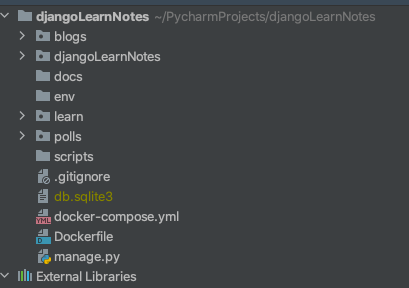
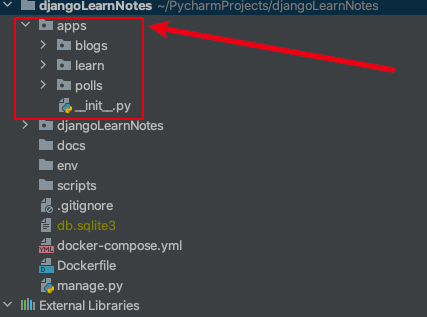
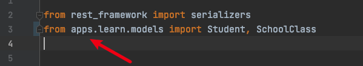
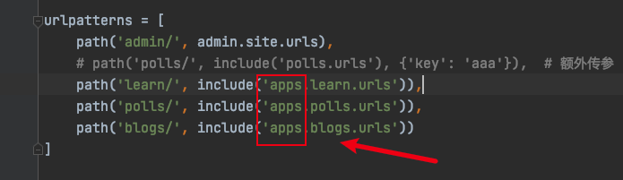
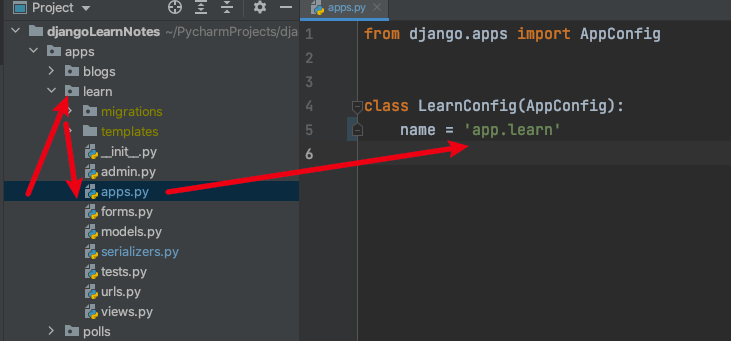
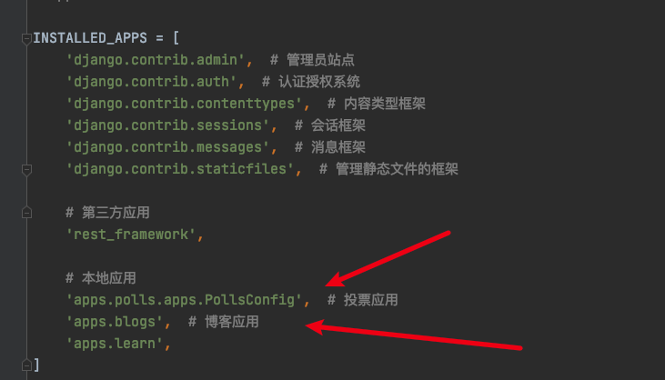
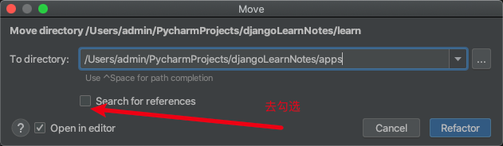

# django目录结构建议

## 1. 规范目录结构理由

"项目目录结构"其实也是属于"可读性和可维护性"的范畴，我们**设计一个层次清晰的目录结构，就是为了达到以下两点好处:**

 **1.可读性高**: 不熟悉这个项目的代码的人，一眼就能看懂目录结构，知道程序启动脚本是哪个，测试目录在哪儿，配置文件在哪儿等等。从而非常快速的了解这个项目。

 **2.可维护性高**: 定义好组织规则后，维护者就能很明确地知道，新增的哪个文件和代码应该放在什么目录之下。这个好处是，随着时间的推移，代码/配置的规模增加，项目结构不会混乱，仍然能够组织良好。

所以，我认为，保持一个层次清晰的目录结构是有必要的。更何况组织一个良好的工程目录，其实是一件很简单的事儿。

## 2. 问题描述

目前组内的django项目，应用都是创建在项目根目录下。除开应用的目录，还有其他文档docs目录、项目的djangoLearnNotes目录、配置目录env、脚本目录scripts，**全部在一个层级就会比较混乱**。

假设我有三个应用blogs、learn、polls，直接创建之后的文档结构如下：



## 3. 解决问题（建议）

可以创建一个**apps**的目录，将应用放入其中，这里就会显得目录结构比较清晰



## 4. 移动后项目的改变

### 4.1 改变依赖路径

1. 移动项目会使之前对其他应用模块的依赖出现错乱，要在所有`import`依赖前加上`apps.`



2. 根项目下的`urls.py`要改变的依赖要改变，要在所有依赖前加上`apps.`



3. 应用目录下的`apps.py`中的类XxxConfig中的`name`属性要加前缀`apps.`



4. 要修改`settings.py`中的引入应用`INSTALLED_APPS`，加上前缀`apps.`（其实这里的配置如果采用简写形式配置的话，应该要和类XxxConfig中的`name`属性一致才行），下图展示了两种配置形式：



### 4.2 已有项目的解决方案

#### 4.2.1 避免上述四处的修改

对于上述移动目录后的修改还是蛮大的，可以采取将`apps`目录加入`sys.path`中去，这样就可以**避免上述四处的修改**了。

在`settings.py`中添加以下配置：

```python
# 设置apps路径
import sys
sys.path.insert(0, os.path.join(BASE_DIR, 'apps'))
```

**注意：**在使用Pycharm将应用拖入`apps`目录下时要注意去勾选`Search for references`，防止Pycharm自动帮你在`import`语句那加上`apps.`前缀



#### 4.2.2 新建app

怎么新建app在`apps`目录下呢？

生成的app默认是被创建在执行命令的当前目录下，因此

可以采取以下方式生成app在`apps`目录下：

```sh
# 先进入apps目录下，再执行startapp命令
cd apps && python3 ../manage.py startapp app_name

```

